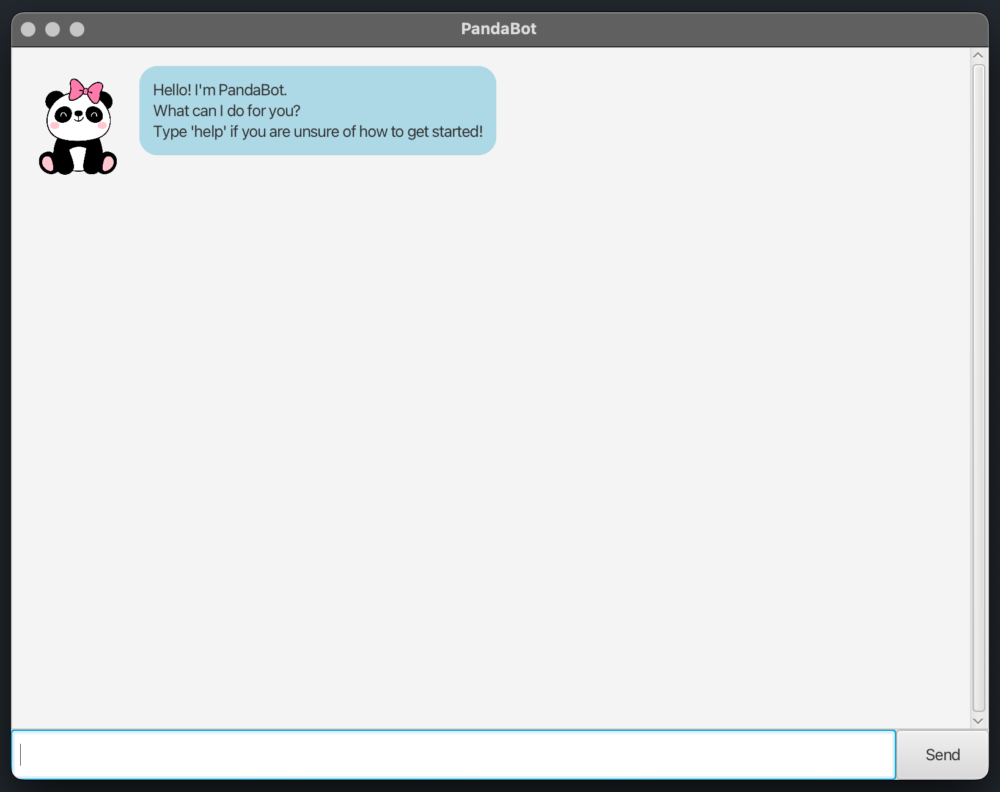

# PandaBot User Guide

> "_Productivity is never an accident. It is always the result of a commitment to excellence, intelligent planning, and focused effort._" – Paul J. Meyer [(source)](https://dansilvestre.com/productivity-quotes/)

Prerequisites: JDK 17.
- **For Windows Users:** [Oracle Version](https://www.oracle.com/java/technologies/downloads/#java17)
- **For Mac Users:** [JDK 17 (Azul)](https://se-education.org/guides/tutorials/javaInstallationMac.html)

PandaBot frees your mind from remembering tasks and lets you focus on what truly matters. It's:

- **text-based**
- **easy to use**
- **FAST** 🚀

### Getting Started

1. Ensure you have Java `17` or above installed in your Computer.
2. Download the latest PandaBot.jar file from [here](https://github.com/adipanda2002/ip/releases).
3. Place the file into the folder you want to use as the _home folder_ for PandaBot.
4. Open a command terminal, `cd` into the folder you put the jar file in, and use the `java -jar PandaBot.jar` command to run the application.
   A GUI similar to the below should appear in a few seconds.
   
5. Type the command in the command box and press Enter to execute it. e.g. typing `help` and pressing Enter will open the help window.
6. Refer to the [documentation](https://adipanda2002.github.io/ip/) for a complete user guide for PandaBot

#

Here is a sample interaction with the PandaBot:

