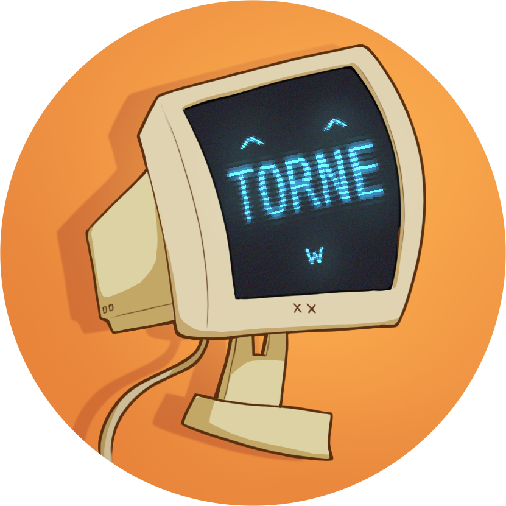

# Torne

This is the chatbot `torne.ui.Torne`, short for `Torment Nexus`.

## How to Run

Make sure you have Java installed and accessible from your CLI.

1. Go to [releases](https://github.com/Zeepheru/ip/releases).
2. Find the newest release and download the `torne.jar` file.
3. In your terminal, navigate to the location of the `torne.jar` file and run `java -jar torne.jar`.

## User Guide

[https://zeepheru.github.io/ip/](https://zeepheru.github.io/ip/)
