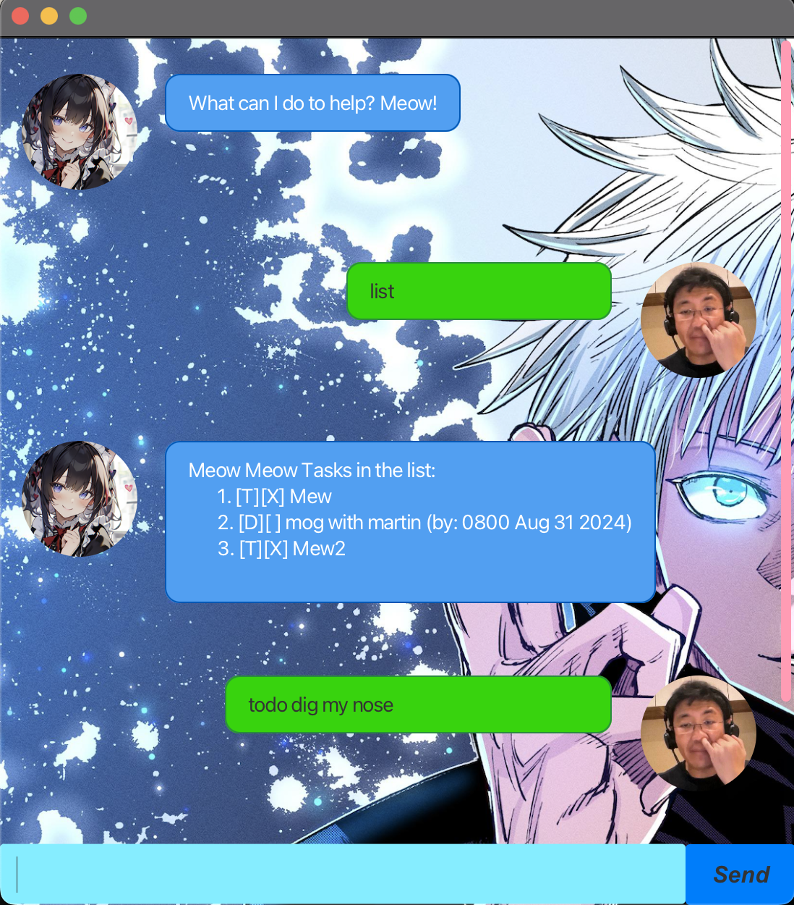

# Danny Chatbot

This is a project for a CS2103T Software engineering project.

Full docs: https://therarefox.github.io/ip/

Releases: https://github.com/TheRareFox/ip/releases

## Quick Start

1. Ensure you have Java `17` or above installed in your Computer.

2. Download the latest `.jar` file from [here](https://github.com/TheRareFox/ip/releases).

3. Copy the file to the folder you want to use as the _home folder_ for your chatbot.

4. Open a command terminal, `cd` into the folder you put the jar file in, and use the `java -jar danny.jar` command to
   run the application.

   A GUI similar to the below should appear in a few seconds.
   

5. Type the command in the command box and press Enter to execute it. e.g. typing **`list`** and pressing Enter will
   open the list menu.
   Some example commands you can try:

    - `list` : Lists all contacts.

    - `delete 3` : Deletes the 3rd task shown in the current list.

    - `bye` : Exits the app.

6. Refer to the [Features](#features-) below for details of each command.

