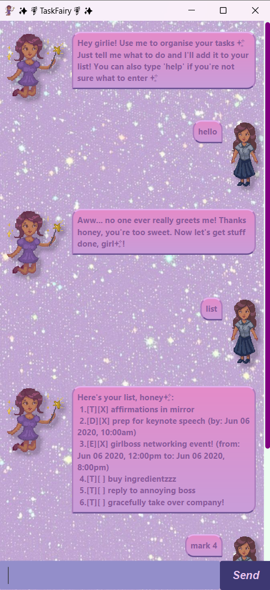

# Moody User Guide

**Moody** is a chatbot designed to manage your tasks within _SECONDS_ using CLI



## Summary List of Features
> “You never finish a program, you just stop working on it” – Anonymous ([source](https://softwarequotes.com/quote/you-never-finish-a-program--you-just-stop-working-))
1. Adding/Deleting Tasks
* Todo Task
* Deadline Task
* Event Task
2. Listing all Tasks
3. Marking/Unmarking a Task's completion status
4. Tagging/Untagging a Task
5. Finding a specific Task
6. Exiting the GUI


## 1. Adding Todo Task

To add a task, use the `todo` command followed by the task name.

### Example Usage
`todo task1`

### Expected Output
The console will print the following. Do note that the number of tasks is dependent on the user's tasks.

```
___________________________________________________________
Got it. I've added this task:
    [T][ ] task1 
Now you have 5 tasks in the list.
___________________________________________________________
```

## 2. Adding Deadline Task
To add a deadline task, use the `deadline` command followed by the task name, `/by` keyword, and the timeframe in yyyy-MM-dd HHmm format.

### Example Usage
`deadline iP Week 6 /by 2024-09-20 1600`

### Expected Output
The console will print the following. Do note that the number of tasks is dependent on the user's tasks.
```
___________________________________________________________
Got it. I've added this task:
    [D][ ] iP Week 6 (by: Sep 20 2024 4:00 pm) 
Now you have 6 tasks in the list.
___________________________________________________________
```

## 3. Adding Event Task
To add an event task, use the `event` command followed by the task name, `/from` keyword,
the starting date in yyyy-MM-dd HHmm format, `/to` keyword, and the ending date in yyyy-MM-dd HHmm format.

### Example Usage
`event NUS CCA /from 2024-09-18 1830 /to 2024-09-18 1930`

### Expected Output
The console will print the following. Do note that the number of tasks is dependent on the user's tasks.
```
___________________________________________________________
Got it. I've added this task:
    [E][ ] NUS CCA (from: Sep 18 2024 6:30 pm to: Sep 18 2024 7:30 pm) 
Now you have 7 tasks in the list.
___________________________________________________________
```
## 4. View All Tasks

To view all tasks, use the `list` command.

### Example Usage
`list`

### Expected Output
The console will print the following. Do note that what is listed is dependent on the user's tasks.

```
___________________________________________________________
1. [T][ ] todoTest #test1 #test2
2. [D][ ] deadlineTest (by: Sep 16 2024 4:00 pm) #test1
3. [E][ ] eventTest (from: Sep 16 2024 4:00 pm to: Sep 16 2024 5:00 pm) #test1 #test2
4. [D][ ] iP week 6 submission (by: Sep 20 2024 4:00 pm) 
5. [T][ ] task1 
6. [D][ ] iP Week 6 (by: Sep 20 2024 4:00 pm) 
7. [E][ ] NUS CCA (from: Sep 18 2024 6:30 pm to: Sep 18 2024 7:30 pm) 
___________________________________________________________
```
## 5. Marking Tasks

To mark a Task as complete, use the `mark` command, followed by the task number.

### Example Usage
Using the above list, suppose we wish to mark task 1.
```
mark 1
```

### Expected Output
The console will print the following. Do note that what is shown is dependent on the user's tasks.

```
___________________________________________________________
Nice! I've marked this task as done:
[T][X] todoTest #test1 #test2
___________________________________________________________
```
## 6. Unmarking Tasks

To unmark a completed Task, use the `unmark` command, followed by the task number.

### Example Usage
```
unmark 1
```
### Expected Output
The console will print the following. Do note that what is listed is dependent on the user's tasks.

```
___________________________________________________________
OK, I've marked this task as not done yet:
[T][ ] todoTest #test1 #test2
___________________________________________________________
```
## 7. Tagging Tasks

To tag a Task, use the `tag` command, followed by the task number, and the tag name.

### Example Usage
```
tag 1 test3
```

### Expected Output
The console will print the following. Do note that what is listed is dependent on the user's tasks.

```
Tag added: test3
[T][] todoTest #test1 #test2 #test3
```
## 8. Untagging Tasks

To remove a tag in a Task, use the `untag` command, followed by the task number, and the name of the task.

### Example Usage
```
untag 1 test3
```

### Expected Output
The console will print the following. Do note that what is listed is dependent on the user's tasks.

```
Tag removed: test3
[T][] todoTest #test1 #test2
```
## 9. Finding Tasks

To find a Task, use the `find` command, followed by the specific keyword.
* The search is case-insensitive, and all tasks whose description contains the keyword will be returned.

### Example Usage
```
find todoTest
```

### Expected Output
The console will print the following. Do note that what is listed is dependent on the user's tasks.

```
Here are the matching tasks in your list:
1. [T][ ] todoTest #test1 #test2
___________________________________________________________
```
## 10. Exiting the GUI

To exit the GUI, use the `bye` command.

### Example Usage
```
bye
```

### Expected Output
The console will print the following. Do note that what is listed is dependent on the user's tasks.

```
___________________________________________________________
Bye. Hope to see you again soon!
___________________________________________________________
```
Enjoy using Moody! 😆

