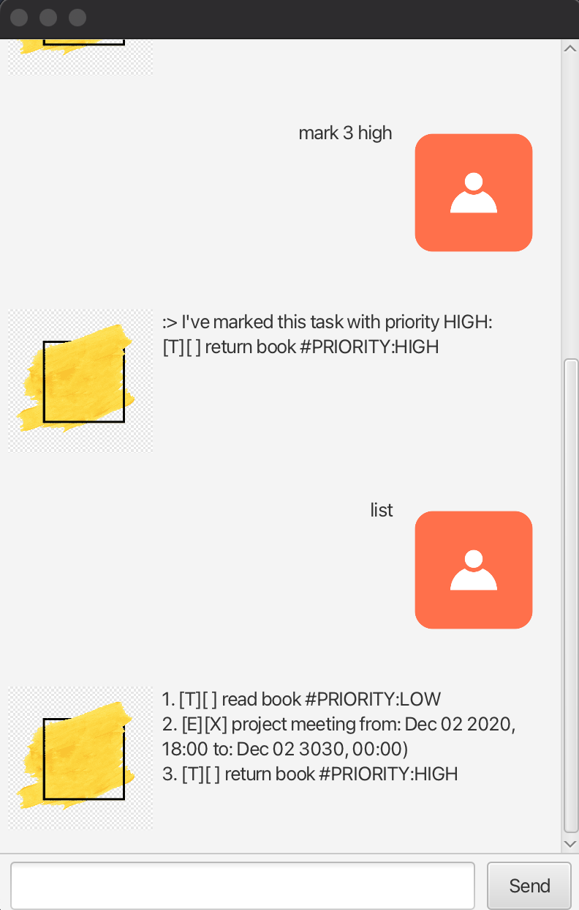

# Hyperion User Guide

Welcome to **Hyperion** your all-in-one solution for task management.

## Feature List
- Add ToDos
- Add Deadlines
- Add Events
- Delete Tasks
- Find Tasks
- List Tasks
- Mark Tasks
- Unmark Tasks
- Sort Tasks
- Exit

## Notes about the command format
1. Words in `UPPER_CASE` are the parameters to be supplied by the user
   e.g. in `deadline NAME /by DATE_AND_TIME`, `NAME` and `DATE_AND_TIME` 
        are parameters which can be used as `deadline assignment /by 2024-12-12T23:59`

2. All the `DATE_AND_TIME` fields must be in the following format `YYYY-MM-DDTHH-MM`
   e.g. the input `2024-12-12T23:59` will be understood as `12 Dec 2024 23:59`

3. All the `INDEX` fields are with respect to the index of tasks after running the `list` command.

## Add ToDos
Adds a basic ToDo task into the list of current tasks.

Format: `todo NAME`

Examples: 
- `todo go for a run`
- `todo walk the dog`

## Add Deadlines
Adds a task with deadline to the list of current tasks.

Format: `deadline NAME /by DATE_AND_TIME`

Examples:
- `deadline assignment /by 2024-12-12T23:59`
- `deadline submit proposal /by 2025-01-31T11:00`

## Add Events
Adds an event task that has a start and end time into the list of current tasks.

Format: `event NAME /from DATE_AND_TIME /to DATE_AND_TIME`

Examples:
- `event meeting /from 2024-12-31T10:00 /to 2024-12-31T12:00` will add an event 
   with the name `meeting`, start time of `31 Dec 2024 10:00`, and end time of 
   `31 Dec 2024 12:00`
- `event meeting /from 2025-12-31T12:00 /to 2024-12-31T12:00` will not be allowed
   because the start time must be **earlier** than the end time

## Delete Tasks
Deletes a task with the specified index

Format: `delete INDEX`
- The index **must be a positive integer** 1, 2, 3, ...
- The index must reference an index of a task that appears after the `list` command is run

Examples:
- `delete 1` will delete the task with numbering 1

## Find Tasks
Finds all the tasks in the current list of tasks whose description contains the input from user

Format: `find STRING`

Examples:
- `find tutorial` will find all the tasks that contains the word `tutorial`

## List Tasks
Displays all the tasks in the current list of tasks

Format: `list`
- There should not be anything keyed in after the command `list`

Examples:
- `list`
- `list something` will not be recognised

## Mark Tasks
Marks the specified task as done

Format: `mark INDEX`
- The index **must be a positive integer** 1, 2, 3, ...
- The index must reference an index of a task that appears after the `list` command is run
- If the specified task is already marked, then it does nothing to it

Examples:
- If the first task in the list is `1.[T][] read a book` then `mark 1` will turn it into
   `1.[T][X] read a book`
- If there are 8 tasks in the list, then `mark 9` will result in an error

## Unmark Tasks
Marks the specified task as not done

Format: `unmark INDEX`
- The index **must be a positive integer** 1, 2, 3, ...
- The index must reference an index of a task that appears after the `list` command is run
- If the specified task is already marked, then it does nothing to it

Examples:
- If the first task in the list is `1.[T][X] read a book` then `unmark 1` will turn it into
  `1.[T][] read a book`
- If there are 8 tasks in the list, then `unmark 9` will result in an error

## Sort Tasks
Sorts all the Tasks in the current list of tasks.
- ToDos will be displayed first, followed by Deadlines, and Events
- Amongst ToDos, they are sorted in ascending ASCII order of their `NAME`
- Amongst Deadlines, they are sorted in ascending order of their deadline `DATE_AND_TIME`
- Amongst Events, they are sorted in ascending order of their start time `DATE_AND_TIME`

Format: `sort`
- There should not be anything keyed in after the command `sort`

Examples:
- `sort`
- `sort something` will not be recognised

## Exit
Displays goodbye message

Format: `bye`
- There should not be anything keyed in after the command `bye`

Examples:
- `bye`
- `bye something` will not be recognised

## Credits
### Picture used in the background of Hyperion
Picture is taken from [Pinterest](https://mx.pinterest.com/pin/12455336463916343/)
### Picture used for Hyperion
Picture is taken from [Pinterest](https://es.pinterest.com/pin/770748923699165505/)
### Picture used for User
Picture is taken from [Pinterest](https://in.pinterest.com/pin/789255903434026657/)

