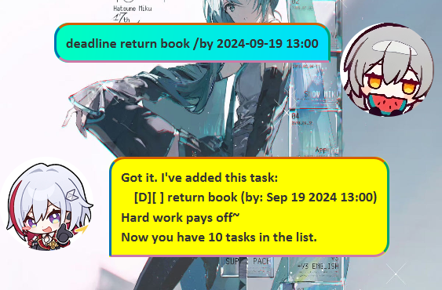

# Denim User Guide 💖

Welcome to **Denim**, your super cute and efficient task management companion! Whether you're keeping track of deadlines, events, or your everyday to-dos, Denim is here to help you stay organized with a sprinkle of kawaii magic. Let's dive into the features and learn how to make the most out of Denim! 🌸✨

---

- Quick Start Guide
  - Installation
  - Summary of Commands
- Features
  - Getting Help: `help`
  - Adding a Todo Task: `todo`
  - Adding an Event Task: `event`
  - Adding a Deadline Task: `deadline`
  - Listing out tasks: `list`
  - Finding a specific task: `find`
  - Marking a task as Complete: `mark`
  - Marking a task as Incomplete: `unmark`
  - Deleting a task: `delete`

## Quick Start Guide

### Installation

1. **Download the latest `.jar` file** from the [official website](#).
2. **Copy the file to the folder you want to use as the home folder for the application**
3. **Open a command terminal**, `cd` into the folder and use the `java -jar denim.jar` to run the application.
4. **A GUI should appear as such with some sample data.**

---

### Summary of Commands

Denim operates through simple text commands. Here's how to get started:

- **Adding a Todo**: `todo <description>`
- **Adding a Deadline**: `deadline <description> /by <dd/MM/yyyy HHmm>`
- **Adding an Event**: `event <description> /from <dd/MM/yyyy HHmm> /to <dd/MM/yyyy HHmm>`
- **Listing Tasks**: `list`
- **Marking a Task**: `mark <taskNumber>`
- **Unmarking a Task**: `unmark <taskNumber>`
- **Deleting a Task**: `delete <taskNumber>`
- **Finding Tasks**: `find <keyword>`
- **Getting Help**: `help`
- **Exiting Denim**: `bye`

---

## Features

### Getting Help: `help`

Lists out the commands available in the program. Alternatively, you can click the Help Button in the GUI.

Format: `help`

Example: `help`

### Adding a Todo Task: `todo`

Adds a todo task to the list of tasks.

Format: `todo <taskDescription>`

Examples:
- `todo clean the garage`
- `todo shower`

### Adding an Event Task: `event`

Adds an event task to the list of tasks.

Format: `event <taskDescription> /from <dateTime> /to <dateTime>`

Note: `<dateTime>` is in `dd/MM/yyyy HHmm`

Examples:
- `event company dinner /from 20/04/2002 1900 /to 20/02/2002 2100`
- `event fishing trip /from 22/05/2002 0800 /to 24/05/2002 1800`

### Adding a Deadline Task: `deadline`

Adds a task with a deadline to the list of tasks.

Format: `deadline <taskDescription> /by <dateTime>`

Note: `<dateTime>` is in `dd/MM/yyyy HHmm`

Examples:
- `deadline submit project report /by 18/02/2002 1800`
- `deadline project assignment /by 17/02/2002 1800`

### Listing Tasks: `list`

Lists out all the tasks in the list of tasks.

Format: `list`

Example: `list`

### Finding a specific task: `find`

Finds a specific task in the list of tasks via String matching.

Format: `find <taskDescription>`

Example: `find project`

### Marking a task as Complete: `mark`

Marks a specific task in the list of tasks as complete.

Format: `mark <taskNumber>`

Examples:
- `mark 1`
- `mark 2`

### Marking a task as Incomplete: `unmark`

Unmarks a specific task in the list of tasks as incomplete.

Format: `unmark <taskNumber>`

Examples:
- `unmark 1`
- `unmark 2`

### Deleting a task: `delete`

Deletes a specific task in the list of tasks.

Format: `delete <taskNumber>`

Examples:
- `delete 4`
- `delete 3`

