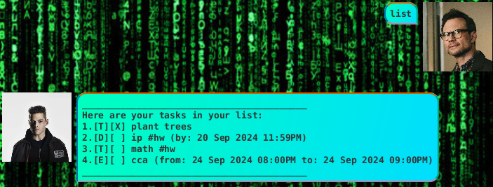
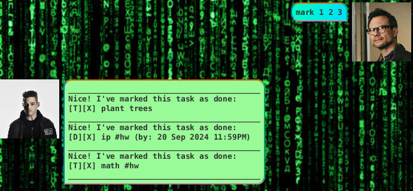
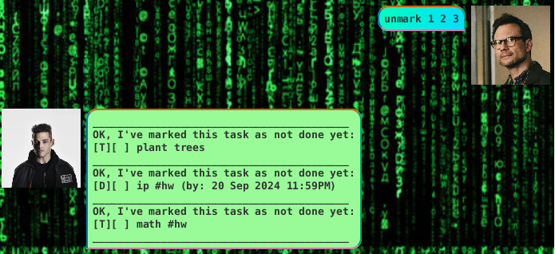
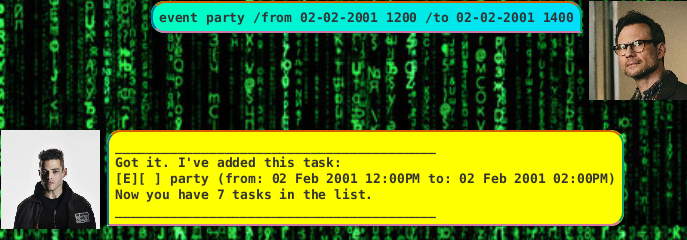
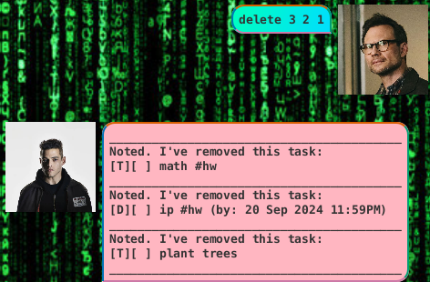

# Elliot User Guide
## Table of Content
- [Introduction](#introduction)
- [Quick Preview](#quick-preview)
- [Features](#features)
    - [List tasks](#list)
    - [Mark task](#mark)
    - [Unmark task](#unmark)
    - [Add task](#add-task)
        - [Add todo task](#todo-task)
        - [Add deadline task](#deadline-task)
        - [Add event task](#event-task)
    - [Delete task](#delete)
    - [Find task](#find)
    - [Tag task](#tag)
        - [Find task via tags](#find-tag)
- [How To Use](#how-to-use)
- [Acknowledgements](#acknowledgements)

## Introduction
___Elliot___ is a task manager that can keep track of all your tasks.

## Quick Preview


## Features
Available Features:
- Display the entire list of tasks
- Mark the task as done
- Unmark the task as not done
- Add a todo task
- Add a event task
- Add a deadline task
- Delete a task in the tasklist
- Find a task in the tasklist
- Add tags to a Task
- Find task by tags

### List
Displays all the task you have currently.
Example use of the following command:
```
list
```
Expected Result:



### Mark
Marks task as done.
Example use of the following command:
```
mark 1 2 3
```
Expected Result:



### Unmark
Unmarks task as not done.
Example use of the following command:
```
unmark 1 2 3
```
Expected Result:



### Add Task
Add different types task to the list of tasks.
#### Todo Task
Add a todo task to the task list.
Example use of the following command:
```
todo ride bike
```
Expected Result:


#### Deadline Task
Add a task with a deadline to the task list.
Example use of the following command:
```
deadline homework /by 02-02-2001 1200
```
Expected Result:


#### Event Task
Add a event to the task list.
Example use of the following command:
```
event party /from 02-02-2001 1200 /to 02-02-2001 1400
```
Expected Result:



### Delete
Delete task from task list.
Example use of the following command:
```
delete 3 2 1
```
Expected Result:



### Find
Find task with the same task description.
Example use of the following command:
```
find math
```
Expected Result:


### Tag
Tags task.
Example use of the following command:
```
todo math assignment 3 #hw
```
Expected Result:


#### Find Tag
Since task now can have tags, we can also search tasks with same tags.
Example use of the following command:
```
findtag #hw
```
Expected Result:


## How to use 
Make sure you have at least Version 17 of `java` first.
- download the latest `elliot.jar` from [releases](https://github.com/LimKaiWei/ip/releases).
- create a new folder and move jar file to empty folder.
- open a terminal in that folder.
- run the command `java -jar elliot.jar`.
- enjoy.

## Acknowledgements
use of _ImList_ from CS2030
