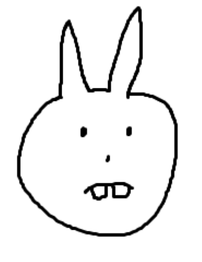

#  David User Guide


David is a task list tracker, enhanced and optimised for users who prefer
typing. 

The features David provides include:
- [x] Add tasks (Todo tasks, Deadline tasks and event tasks)
- [x] Delete tasks
- [x] Local caching of tasks 
- [x] Sort of tasks
- [x] Find tasks
- [x] Mark and unmark of tasks

## Add todos
Task specifier: `todo`

Required arguments: -

Example: `todo eat`


## Add deadlines
Task specifier: `deadline`

Required arguments: `/by`

Deadlines should be appended with an input in the format of "YYYY-MM-DD HHHH"
where 
- "Y" reprsents the year 
- "M" represents the month 
- "D" represents the day of the month
- "H" represents the 24-hour time

Example: `deadline cs2100 assignment /by 2024-12-12 1230`

## Add events
Task specifier: `event`

Required arguments:
- `/from` - start date and time
- `/to` - end date and time

`/from` and `/to` should be appended with an input in the format of "YYYY-MM-DD HHHH"
where
- "Y" reprsents the year
- "M" represents the month
- "D" represents the day of the month
- "H" represents the 24-hour time

Example: `event dance /from 2024-12-12 1230 /to 2024-12-12 1330`

## List tasks
Task specifier: `list`

Required arguments: -

Example: `list`

## Mark and unmark tasks
Task specifier: `mark` or `unmark`

Required arguments: `i` task number to mark or unmark

Example:
```
mark 1
unmark 1
```

## Find tasks
Returns all tasks that matches the given event name.

Task specifier: `find`

Required arguments: `eventName` eventName to find

Example: `find eat`

## Delet tasks

Task specifier: `delete`

Required arguments: `i` task number to delete

Example: `delete 1`

## Sort tasks
Sorts all tasks in the given order.

Task specifier: `sort`

Parameters accepted:
- `asc` - ascending order
- `desc` - descending order

Example: `sort asc`