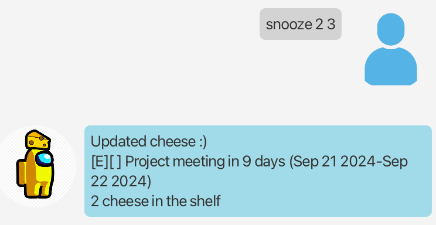

# CheeseBot User Guide

  

CheeseBot is an intuitive task management bot designed to help users organize tasks,
set deadlines, manage events, 
and much more—all while keeping things lighthearted with cheese-themed interactions.

## Overview
- [Quick start](#Quick-start)
- [Features](#features)
  - [Todo](#adding-a-todo-task-todo)
  - [Deadline](#adding-a-deadline-task-deadline)
  - [Event](#adding-an-event-task-event)
  - [List](#listing-tasks-list)
  - [Mark task](#marking-tasks-mark)
  - [Unmark task](#unmarking-tasks-unmark)
  - [Delete task](#deleting-tasks-delete)
  - [Search task](#command-find-query)
  - [Reschedule task](#rescheduling-tasks-reschedule)
  - [Delay task](#snoozing-tasks-snooze)
  - [Exit program](#close-bot-bye)
  - [Storing data](#saving-the-data)

---
## Quick start
1. Download the newest release from [here](https://github.com/hm-yang1/ip/releases)
2. Ensure you have java 17 and necessary permissions to execute the jar file
3. Run `java -jar cheese.jar`

---
## Features

---
### Adding a ToDo task: `todo`

Easily create a basic to-do task.

#### Command: `todo [task name]`

Example: `todo Buy groceries`

#### Outcome:

---
### Adding a Deadline task: `deadline`
Create a task with a deadline

#### Command: `deadline [task name] /by [date]`
    
* Date must be in `YYYY-MM-YY` format
* Note the `/by`

Example: `deadline Submit report /by 2024-09-20`

---
### Adding an event task: `event`
Create a task with both a start and end date

#### Command: `event [task name] /from [start date] /to [end date]`

* Dates must be in `YYYY-MM-YY` format
* Note the `/from` and `/to`

Example: `event Project meeting /from 2024-09-18 /to 2024-09-19`

---
### Listing tasks: `list`
Easily list all current tasks

#### Command: `list`

Outcome:

---
### Marking tasks: `mark`
Mark a task as competed to stay on track.

#### Command: `mark [index]`

* Index is the index of a task in task list

Example: `mark 2`

Outcome:

---
### Unmarking tasks: `unmark`
Undo the completion status of a task

#### Command: `unmark [index]`

Example: `unmark 2`

---
### Deleting tasks: `delete`
Delete a specific task by its index.

#### Command: `delete [index]`

Example: `delete 1`

---
### Searching for tasks: `find`
Search for tasks by their name.

#### Command: `find [query]`

Example: `find meeting`

Outcome:

---
### Rescheduling Tasks: `reschedule`
Change the date of a task to a later time.

#### Command: `reschedule [index] [YYYY-MM-DD]`

Example: `reschedule 1 2024-09-27`

Outcome:

---
### Snoozing tasks: `snooze`
Delay a task by a number of days with the `snooze` command

#### Command: `snooze [index] [days]`

Example: `snooze 2 3`

Outcome:

---
### Close bot: `bye`
Exit the program

#### Command: `bye`
* Program will close after 3s

---
### Saving the data
CheeseBot data are saved in the `list.txt` in the same directory
