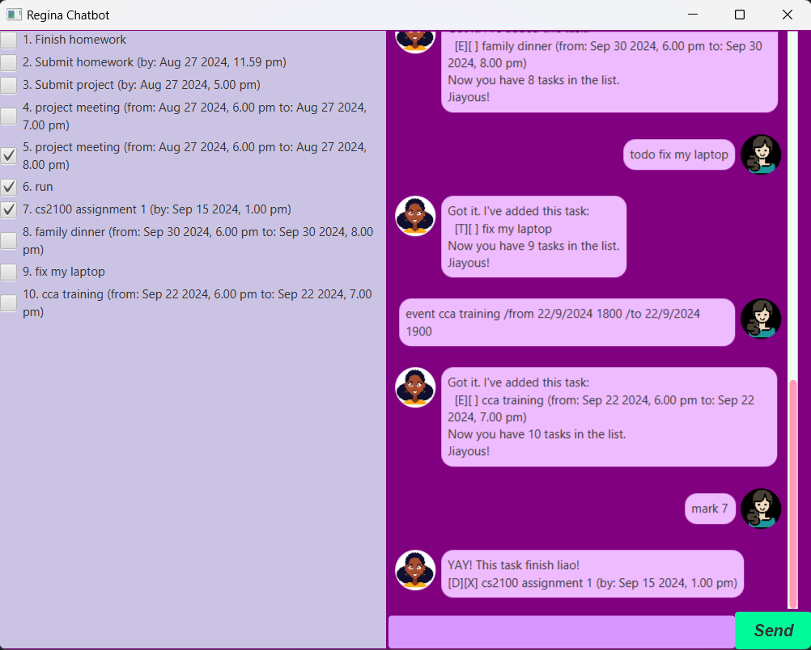

# Regina User Guide



**Product Introduction:**  
Regina is a task management chatbot designed to help you efficiently track your tasks. With Regina, you can create, manage, and organize tasks easily through a user-friendly command interface. She supports three main task types:
- **ToDo:** Tasks without a deadline, which can be done anytime.
- **Deadline:** Tasks that need to be completed by a specific time.
- **Event:** Tasks that have both a start and end time.

## Adding Deadlines

To add a deadline task, use the following command format:

```
deadline <task_name> /by <d/m/yyyy HH/mm>
```

This will add the task to the list of tasks showing on the left side.

**Example:**  
`deadline Submit report /by 2/12/2024 1800`

You will receive a confirmation message as a reply:

```
Got it. I've added this task:
  [D][ ] submit report (by: Dec 02 2024, 6.00pm)
Now you have <number_of_current_tasks> tasks in the list.
Jiayous!
```


## Task List with Checkboxes

On the left side of the chatbot window, you will see a list that updates as you add or delete tasks. You can mark tasks as done or unmark them by simply clicking the checkboxes, rather than typing the commands `mark <task_index>` or `unmark <task_index>`.

## Snoozing Tasks

Only **Event** and **Deadline** type tasks can be snoozed. There are three main types of timing:
- **Days**
- **Hours**
- **Minutes**

**Format:**  
`Snooze <task_index> /by <numeric_value> <timing_type>`

**Example:**  
`snooze 2 /by 2 days`

If you do not specify a specific snooze value, Regina will apply a default snooze period of 30 minutes.

**Example:**  
`snooze 2`

Regina will respond with the updated task details:
```
Pushed back the deadline of <task_description> by <snoozed_value> to <updated_date_and_time>
```