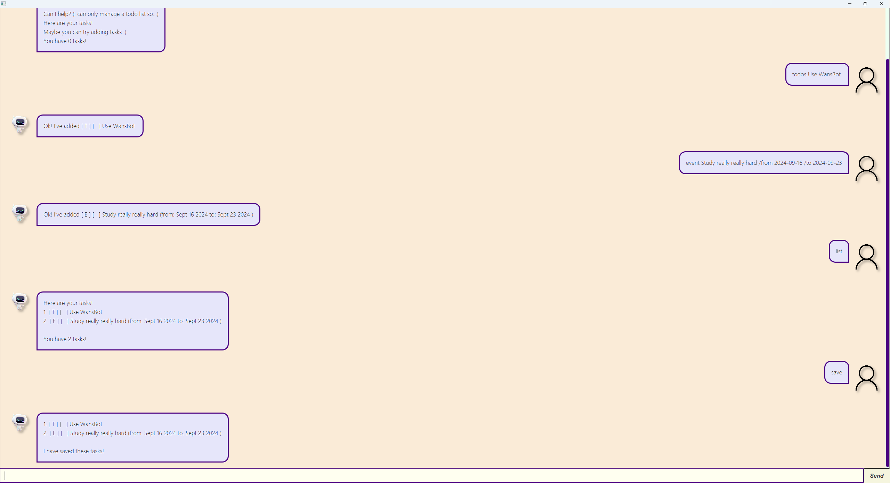

# Pixel User Guide

Pixel is a chatbot that helps you to keep track of your tasks, such as your to dos, deadlines and events!

## Viewing list of tasks: `list`

Shows the list of tasks that the user has added.

Format: `list`

## Adding to dos: `todo` 

Adds a ToDo to the list of tasks

Format: `todo DESCRIPTION`
* `DESCRIPTION` cannot be empty

Examples: 
- `todo read book` Adds a ToDo with a description of `read book`
- `todo print notes` Adds a ToDo with a description of `print notes`

## Adding deadlines: `deadline`

Adds a Deadline to the list of tasks

Format: `todo DESCRIPTION /by DEADLINE`
- `DESCRIPTION` cannot be empty
- `DEADLINE` must be in the format of `YYYY-MM-DD hh:mm`

Examples:
- `deadline read book /by 2024-01-01 14:20` Adds a Deadline with a description of `read book` and a deadline of `2024-01-01 14:20`
- `deadline print notes /by 2024-01-01 05:20` Adds a Deadline with a description of `print notes` and a deadline of `2024-01-01 05:20`

## Adding events: `event`

Adds an event to the list of tasks

Format: `evemt DESCRIPTION /from START_DATETIME /to END_DATETIME`
- `DESCRIPTION` cannot be empty
- `START_DATETIME` must be in the format of `YYYY-MM-DD hh:mm`
- `END_DATETIME` must be in the format of `YYYY-MM-DD hh:mm`

Examples:
- `event read book /from 2024-01-01 14:20 /to 2024-01-01 15:20` Adds an Event with a description of `read book`, a start datetime of `2024-01-01 14:20` and end datetime of `2024-01-01 15:20` 
- `event meeting /from 2024-01-01 05:20 /to 2024-01-01 07:20` Adds a Deadline with a description of `meeting`start datetime of `2024-01-01 05:20` and end datetime of `2024-01-01 07:20`

## Mark task as complete: `mark`

Marks a task as completed

Format: `mark INDEX`
- Marks the task as complete at specified `INDEX`
- The index refers to the index number shown in the displayed tasks list when user runs `list`
- The index must be within the range of available tasks

Examples:
- `mark 5` will mark the 5th task as completed

## Mark task as incomplete: `unmark`

Marks a task as incomplete

Format: `mark INDEX`
- Unmarks the task as incomplete at specified `INDEX`
- The index refers to the index number shown in the displayed tasks list when user runs `list`
- The index must be within the range of available tasks

Examples:
- `unmark 5` will mark the 5th task as completed

## Delete task: `delete`

Deletes a task from the list of tasks

Format: `delete INDEX`
- Deletes the task at specified `INDEX`
- The index refers to the index number shown in the displayed tasks list when user runs `list`
- The index must be within the range of available tasks

Examples:
- `unmark 5` will mark the 5th task as completed

## Find task by keyword: `find`

Finds tasks whose descriptions contain any of the given keywords

Format: `find KEYWORD`
- The keyword should be in lower-case
- Any task description that contains the keyword will be matched e.g. `run` will match both `run` and `runs`

Examples:
- `find read` will find all tasks with the keyword of `read`

## View tasks for date: `view`

Finds deadlines that passes in the date

Format: `view DATE`
- `DATE` should be in the format of `YYYY-MM-DD`

Examples:
- `view 2024-01-01` will find all deadlines that is due on `2024-01-01`

## End program: `bye`

Displays goodbye message and terminates the program.

Format: `bye`
