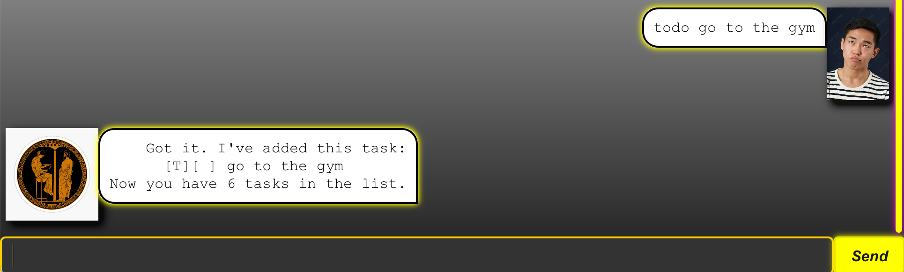
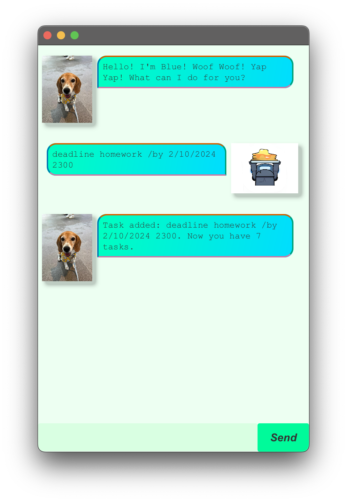
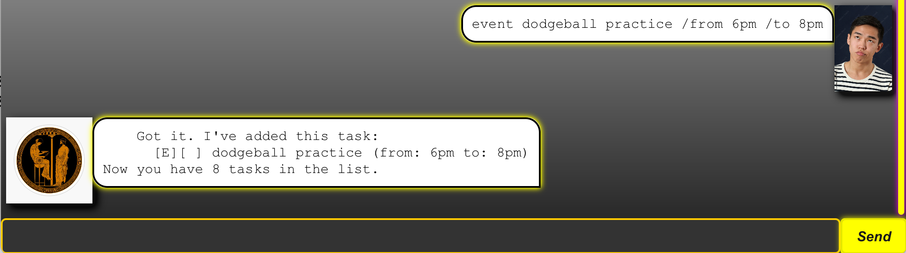
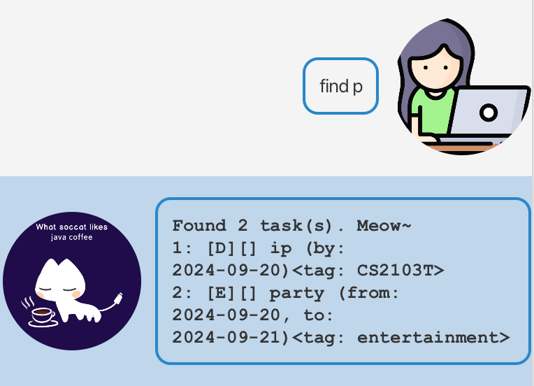

# Delphi User guide

The Delphi Chat Bot is a desktop app for **creating and managing a list of tasks and appointments**, optimized for use via a Command Line Interface (CLI) while still having the benefits of a Graphical User Interface (GUI). If you can type fast, Delphi can manage your tasks faster than traditional GUI apps.
Delphi can remember the tasks you've inputted from the last time you used the app.
## Quick start

1. Ensure you have Java 17 installed.
2. Download the latest .jar file from here.
3. Copy the file to the folder you want to use as the home folder for Delphi.
4. Open a command terminal, cd into the folder you put the jar file in, and use the java -jar Delphi.jar command to run the application.
5. Type commands into the command box and press Enter or click the Send button to execute it.

---

## Features:

### List: `list`

Lists all the tasks that are currently in the task list.

Format: `list`

### Marking: `mark, unmark`

Marks tasks as complete and marks them as incomplete again respectively. Tasks are searched for
by index(task list is 1-indexed, index should be positive integer). Will throw an error if the index is out of range.

Format: `mark INDEX, unmark INDEX`

### Delete: `delete`

Removes tasks from the task list entirely. Tasks are searched for by index(task list is 1-indexed, index should be positive integer).
Will throw an error if the index is out of range.

Format: `delete INDEX`

### To-do: `todo`

adds a todo task to the task list. No date/time associated with this task type.

Format: `todo TASK_DESCRIPTION`

Example: `todo buy dinner`

### Deadline: `deadline`

adds a deadline task to the task list. Task has a single deadline associated with it.
If a date and time of the correct format is provided, it will be parsed appropriately
otherwise whatever string is provided will be used.

Format: `deadline TASK_DESCRIPTION /by DEADLINE`

Examples:
* `deadline finish cs2103T ip /by 20/09/2024 2359`

* `deadline finish essay /by tomorrow`

### Event: `event`

adds an event task to the task list. Task has a time frame(window) associated with it,
in other words there is a **from** date and **to** date. If a date and time of the
correct format is provided, it will be parsed appropriately otherwise whatever string is provided will be used

Format: `event TASK_DESCRIPTION /from START_TIME /to END_TIME`

Examples:
* `event basketball CCA /from 16/09/2024 2000 /to 16/09/2024 2200`

* `deadline finish essay /by tomorrow`

### Find: `find`

Search for tasks that contain a keyword and returns them as a list

Format: `find KEYWORD`

### Update: `update`

Update the deadlines/ time frames of deadlines/events respectively.

Format:
* `update KEYWORD /by NEW_DEADLINE`
*  `update KEYWORD /from NEW_START /to NEW_END`

---

## Things to note

1. The `find` and `update` commands search for the keyword as a substring, so it is important
   to be precise and exact. For example, if `basketball games` and `buy noodles again` are task
   descriptions, then the search keyword `"ga"` will return both of them.
2. The date formats that can be parsed are also limited. In general, the format should be
   "dd/mm/yyyy xxxx" where "xxxx" is the time in 24 hour format.