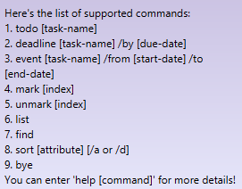
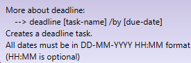
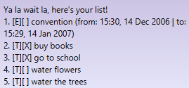
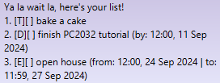
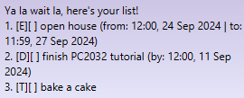

# Jackson
Jackson is a full-time **task manager chatbot**, part-time *Kopitiam uncle*.

Unlike a traditional task manager, Jackson leverages the speed and standardization of the 
**Command-Line Interface (CLI)** style of input, with all functionality *embedded into commands and tags*.
If you can type fast, Jackson can get it done faster.

- [Quick Start](#quick-start)
- [Features and Commands](#features-and-commands)
  - [Help with commands: `help`](#help-with-commands-help)
  - [Viewing the task list: `list`](#viewing-the-task-list-list)
  - [Adding Todo tasks: `todo`](#adding-todo-tasks-todo)
  - [Adding Deadline tasks: `deadline`](#adding-deadline-tasks-deadline)
  - [Adding Event tasks: `event`](#adding-event-tasks-event)
  - [Marking tasks as completed: `mark`](#marking-tasks-as-completed-mark)
  - [Marking tasks as incomplete: `unmark`](#marking-tasks-as-incomplete-unmark)
  - [Deleting tasks: `delete`](#deleting-tasks-delete)
  - [Sorting tasks: `sort`](#sorting-tasks-sort)
  - [Finding tasks: `find`](#finding-tasks-find)
  - [Exiting: `bye`](#exiting-bye)
  - [Saving and Loading](#saving-and-loading)
  - [Task Names](#task-names)
  - [Colour Coding](#colour-coding)
- [FAQ](#faq)
- [Command Summary](#command-summary)

# Quick Start
1. Ensure that you have Java `17` installed on your computer.
2. Download the latest `jar` file from [here](https://github.com/KrashKart/ip/releases).
3. Copy the `jar` file to the folder you'd want to run Jackson on.
4. Run `java -jar jackson_v1.jar` on the command prompt in the same directory.
5. You should see the GUI as shown below:

- To input, type in the text box and either hit Enter or click on the send button.

> [!TIP]
> Try a few commands! You can view the list of supported commands with `help`

# Features and Commands
> [!NOTE]
> Notes about the syntax format:
> - `[NAME OF ARGUMENT]` denotes a mandatory argument for a command.
> - `NAME OF ARGUMENT` denotes a mandatory argument for a format.
> - `(NAME OF ARGUMENT)` denotes an optional argument for either a command or format.
> - Order of arguments **cannot be changed**; strict ordering has to be followed.
> - Extra arguments will be interpreted as _incorrect formatting_

## Help with commands: `help`
This command serves two purposes. Firstly, it displays the list of supported commands:

Format: `help`

Alternatively, suffixing `help` with a command displays more details about the command:

Format: `help [COMMAND]`

## Viewing the task list: `list`
View the task list in its entirety. The display can be interpreted as follows:
- Event type (`T` is a Todo, `E` is an Event and `D` is a deadline)
- Status (`[X]` for completed, `[ ]` otherwise)
- Name
- Start and end dates (if applicable) in `(HH:MM) DD MMM YYYY` format

For example:

Format: `list`

## Adding todo tasks: `todo`
Adds a todo task to the task list. 
- **Does not have a start or end date**.
- The updated size of the task list will be shown.

Format: `todo [NAME]`

## Adding deadline tasks: `deadline`
Adds a deadline task to the task list. 
- **Only has an end date** (known as `BY-DATE`).
- `BY-DATE` must be specified in `DD-MM-YYYY (HH:MM)` format.
- The updated size of the task list will be shown.

Format: `deadline [NAME] /by [BY-DATE]`

## Adding event tasks: `event`
Adds an event task to the task list. 
- **Has both start and end date** (known as `FROM-DATE` and `TO-DATE`).
- Both `FROM-DATE` and `TO-DATE` must be specified in `DD-MM-YYYY (HH:MM)` format.
- `FROM-DATE` cannot be after `TO-DATE`.
- The updated size of the task list will be shown.

Format: `event [NAME] /from [FROM-DATE] /to [TO-DATE]`

## Marking tasks as completed: `mark`
Marks a task at index `i` as completed.
- Updated task description and status will be shown.
- `i` is 1-indexed (ie. `i` starts counting from 1).

Format: `mark [INDEX]`

## Marking tasks as incomplete: `unmark`
Marks a task at index `i` as incomplete.
- Updated task description and status will be shown.
- `i` is 1-indexed (ie. `i` starts counting from 1).

Format: `unmark [INDEX]`

## Deleting tasks: `delete`
Deletes task at index `i`.
- Deleted task description will be shown.
- The updated size of the task list will be shown.
- `i` is 1-indexed (ie. `i` starts counting from 1).

## Sorting tasks: `sort`
Sorts tasks in ascending or descending order based on task attributes.
- Task attributes are:
  - `name` (in lexicographical order)
  - `startdatetime`: for tasks without a start date (`FROM-DATE`), default value is null.
  - `enddatetime`: for tasks without an end date (`TO-DATE` or `BY-DATE`), default value is null.
  - `status`: whether the task is completed or not. In ascending order, completion is "larger".
  - `tasktype`: lexicographical order of whether task is a Todo (`T`), Event (`E`) or deadline (`D`).
- Orders of sorting are:
  - ascending: `/a`, which is the default if no order is given
  - descending: `/d`
- Null values are always considered "largest", in ascending order they are ranked last.

For example: `sort name /d`, before (left) and after (right)

Format: `sort [ATTRIBUTE] (ORDER)`

## Finding tasks: `find`
Finds task names containing the provided keyword.
- Naive search, as long as the task name contains the keyword at all it will be shown.

Format: `find [KEYWORD]`

## Exiting: `bye`
Exits the program.
- Jackson will close the GUI window in 5 seconds after `bye` is called
- Text box and send button are disabled during these 5 seconds

Format: `bye`

## Saving and Loading
Jackson uses active saving in a save file in `/src/main/resources/texts/data.txt`.

The task list is always saved after **any modification to itself**, so there is no need to
use a save command. If the save file does not exist, the program will create a new save file in the path
specified in `Jackson.java`.

During initialisation, Jackson will read from the save file and load all previously loaded tasks
into the current task list.

> [!CAUTION]
> In case of file instability and permissions, it might be safer to store an extra copy
> of `data.txt` when transfering the save file across devices.

## Task Names
Jackson enforces a strict _no-conflict naming_ system. If the user wishes to create tasks of the 
same name (regardless of task type), the user should either rename the task they wish to add or 
delete the pre-existing task in the list. 

> [!TIP]
> Task names are monitored by name only, so any small modification to the name will be accepted 
> as only one-to-one String comparison is used

## Colour Coding
Generally, the GUI employs textbox background colour coding as such:
|Type of Message     |Colour of textbox background|
|:------------------:|:-------------------:|
|User input          | Light blue `#87CEFA`|
|Errors              |Red `#F19595`        |
|List operations     |Orange `#f1cfa2`     |
|Task operations     |Green `90EE90`       |
|Startup and Shutdown|Blue-Green gradient `#96e4d9` and `#c2f3c2`|
|Other Jackson responses|Purple `CBC3E3`|

# FAQ
**Q**: How do I transfer my data to another computer?\
**A**: Simply copy `main/resources/texts/data.txt` into your new computer and install Jackson
using the steps in [Quick Start](#quick-start).

# Command Summary
Click on each command to view the relevant section.

|                     Command                     |                     Usage                      |                              remarks                              |
|:-----------------------------------------------:|:----------------------------------------------:|:-----------------------------------------------------------------:|
|       [`help`](#help-with-commands-help)        |           `help` or `help [COMMAND]`           |                                 -                                 |
|      [`list`](#viewing-the-task-list-list)      |                     `list`                     |                                 -                                 |
|        [`todo`](#adding-todo-tasks-todo)        |                 `todo [NAME]`                  |                                 -                                 |
|  [`deadline`](#adding-deadline-tasks-deadline)  |        `deadline [NAME] /by [BY-DATE]`         |          `[BY-DATE]` in  `DD-MM-YYYY (HH:MM)` format          |
|      [`event`](#adding-event-tasks-event)       | `event [NAME] /from [FROM-DATE] /to [TO-DATE]` | `[FROM-DATE]` and `[TO-DATE]` in  `DD-MM-YYYY (HH:MM)` format |
|   [`mark`](#marking-tasks-as-completed-mark)    |                 `mark [INDEX]`                 |                        1-indexed `[INDEX]`                        |
| [`unmark`](#marking-tasks-as-incomplete-unmark) |                `unmark [INDEX]`                |                        1-indexed `[INDEX]`                        |
|       [`delete`](#deleting-tasks-delete)        |                `delete [INDEX]`                |                        1-indexed `[INDEX]`                        |
|          [`sort`](#sorting-tasks-sort)          |           `sort [ATTRIBUTE] (ORDER)`           |                                 -                                 |
|          [`find`](#finding-tasks-find)          |                `find [KEYWORD]`                |                                 -                                 |
|              [`bye`](#exiting-bye)              |                     `bye `                     |                                 -                                 |
|                      `???`                      |                     `???`                      |                                ???                                |
