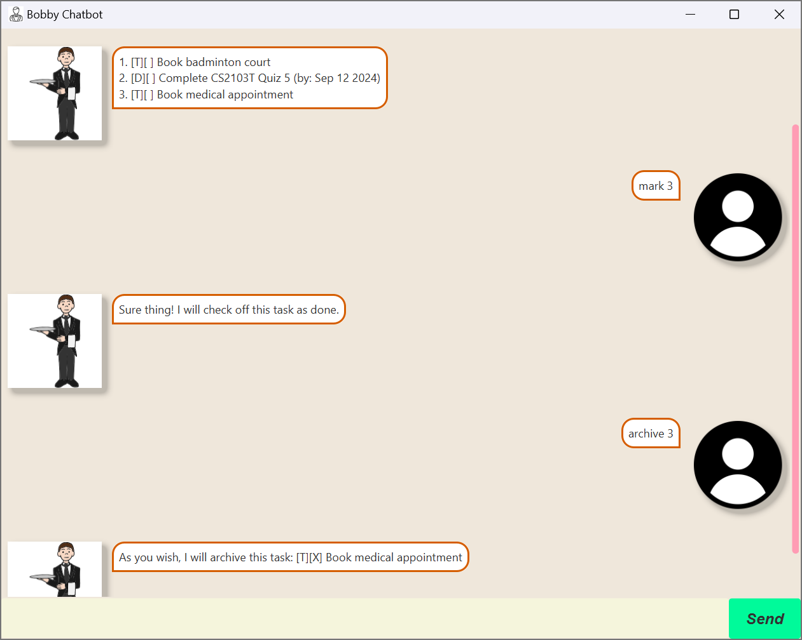

# Light User Guide




Light is a Deathnote-themed task management application that helps users keep track of their tasks, deadlines, and events. It supports adding, listing, marking, unmarking, deleting tasks, and undoing/redoing actions.

## Getting Started

### Prerequisites
- Java 11 or above
- Gradle

### Running the Application
1. Clone the repository.
2. Navigate to the project directory.
3. Run the application using Gradle:
   ```
   gradle run
   ```
## Features

### Adding deadlines
Adds a Deadline task to the task list.

**Usage:** deadline TASK_DESCRIPTION /by DATE TIME

**Example**: `deadline return book /by 3/12/2022 0200`

```
1. [D][ ] return book (by: Dec 3 2022 0200)
```

### Adding events
Adds an Event task to the task list.

**Usage:** event TASK_DESCRIPTION /from DATE TIME /to DATE TIME

**Example**: `event project meeting /from 3/12/2022 0200 /to 4/12/2022 1200`

```
1. [E][ ] project meeting (from: Dec 3 2022 0200 to: Dec 4 2022 1200)
```

### Adding todos
Adds a Todo task to the task list.

**Usage:** todo TASK_DESCRIPTION

**Example**: `todo read book`

```
1. [T][ ] read book
```

### Listing tasks
Lists all tasks in the task list.

**Usage:** list

**Example**: `list`

```
1. [D][ ] return book (by: Dec 3 2022 0200)
2. [E][ ] project meeting (from: Dec 3 2022 0200 to: Dec 4 2022 1200)
3. [T][ ] read book
```

### Marking tasks as done
Marks a task as done.

**Usage:** mark TASK_INDEX

**Example**: `mark 1`

```
1. [D][X] return book (by: Dec 3 2022 0200)
```

### Unmarking tasks
Unmarks a task as done.

**Usage:** unmark TASK_INDEX

**Example**: `unmark 1`

```
1. [D][ ] return book (by: Dec 3 2022 0200)
```

### Deleting tasks
Deletes a task from the task list.

**Usage:** delete TASK_INDEX

**Example**: `delete 1`

```
1. [E][ ] project meeting (from: Dec 3 2022 0200 to: Dec 4 2022 1200)
2. [T][ ] read book
```
to
```
1. [T][ ] read book
```

### Undoing actions
Undoes the last action.

**Usage:** undo

**Example**: `undo` (after doing `todo read book`)

```
1. [D][ ] return book (by: Dec 3 2022 0200)
2. [E][ ] project meeting (from: Dec 3 2022 0200 to: Dec 4 2022 1200)
3. [T][ ] read book
```
to
```
1. [D][ ] return book (by: Dec 3 2022 0200)
2. [E][ ] project meeting (from: Dec 3 2022 0200 to: Dec 4 2022 1200)
```

### Redoing actions
Redoes the last undone action.

**Usage:** redo after doing `undo`

**Example**: `redo`

```
1. [D][ ] return book (by: Dec 3 2022 0200)
2. [E][ ] project meeting (from: Dec 3 2022 0200 to: Dec 4 2022 1200)
```
to
```
1. [D][ ] return book (by: Dec 3 2022 0200)
2. [E][ ] project meeting (from: Dec 3 2022 0200 to: Dec 4 2022 1200)
3. [T][ ] read book
```

### Finding tasks
Finds tasks that contain the keyword.

**Usage:** find KEYWORD

**Example**: `find book`

```
1. [D][ ] return book (by: Dec 3 2022 0200)
2. [T][ ] read book
```

### Instructions
Displays the list of commands available.

**Usage:** help

**Example**: `help`

```
Here are the list of commands you can use:
1. todo <description> - Adds a todo task to the task list.
2. deadline <description> /by <date(DD/MM/YYYY)> <time(24HR)> - Adds a deadline task to the task list.
3. event <description> /from <date(DD/MM/YYYY)> <time(24HR)> /to <date(DD/MM/YYYY)> <time(24HR)> - Adds an event task to the task list.
4. list - Lists all tasks in the task list.
5. mark <task number> - Marks a task as done.
6. unmark <task number> - Marks a task as undone.
7. delete <task number> - Deletes a task from the task list.
8. find <keyword> - Finds tasks with the keyword in the task list.
9. undo - Undoes the previous command.
10. redo - Redoes the previous command.
11. bye - Exits the program.
12. help - Shows the list of commands you can use.
```

### Exiting the application
Exits the application.

**Usage:** bye

**Example**: `bye`

```
Bye. Hope to see you again soon!
```

## Acknowledgements
Images used:
1. [Light_Yagami](https://en.wikipedia.org/wiki/File:Light_from_Death_Note.jpg)
2. [Ryuk](https://static.wikia.nocookie.net/all-worlds-alliance/images/b/b1/D87d814ca13eaa34c11af49e09dd6a28--death-note-cosplay-shinigami.png/revision/latest?cb=20190130121440)
3. [Background](https://www.freepik.com/free-photo/white-crinkled-paper-texture-background_13461872.htm#query=paper%20texture&position=2&from_view=keyword&track=ais_hybrid&uuid=3b33941a-3d2c-4820-b104-1c36398c3d09)