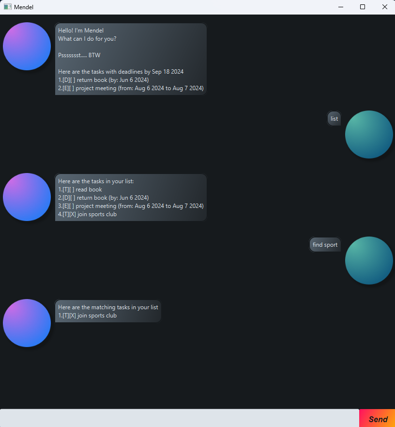

# Count User Guide




Welcome to Count, your new digital assistant here to help streamline your day!
Now with innovative functions such as a built-in task list,
you can effortlessly manage and track your tasks and deadlines,
ensuring nothing slips through the cracks.

## How do I use Count?

This readme serves as the documentation guide for how to talk to Count Borg!
But you could always just ask the amphibian himself.

Template: `help`

```
1.'hello': Prompts me for a greeting!
Usecase: hello
.
.
.
10.'remind': Reminds the user what tasks are due in within the specified number of days.
Usecase: remind 7
```

## Adding a To-Do Task

A to-do task would be a non-pressing task with no fixed due date.
An example would be something basic like, buy bread for a snack

Template: `todo buy bread for a snack`

Count Borg will then add it to your task list!

```
Ribbit, added the following task:
[T][ ] buy bread for a snack
You now have 1 task(s) in your list
```

## Adding a Deadline Task

A deadline task as it's name suggests, has a do-by-date.
An example would be something like, homework due on 20th October 2024

Template: `deadline do homework /by 20/10/2024`

```
Ribbit, added the following task:
[D][ ] do homework (by: October 20 2024)
You now have 2 task(s) in your list
```

## Adding an Event Task

An Event task is one that runs from a start time, to an end time.
An example would be something like,
a holiday overseas from 10th September 2024 to 17th September 2024

Template: `event on Holiday! /from 10/09/2024 /to 17/09/2024`

```
Ribbit, added the following task:
[E][ ] on Holiday! (from: September 10 2024 to: September 17 2024)
You now have 3 task(s) in your list
```

## Seeing what is on the Task List

To view all tasks added to Count, it's as simple as just asking!

Template: `list`

```
Here are the tasks in your list:
1.[T][ ] buy bread for a snack
2.[D][ ] do homework (by: October 20 2024)
3.[E][ ] on Holiday! (from: September 10 2024 to: September 17 2024)
```

## Mark a Task as Complete

Done with a task? Mark it as done! 
For example, if you are done buying bread...

Template: `mark 1`

```
Ribbit, I have marked this task as complete:
[T][X] buy bread for a snack
```

## Mark a Task as Incomplete

Maybe not done yet?
For example, if you mistakenly marked buying bread as complete...

Template: `unmark 1`

```
Ribbit, I have marked this task as incomplete:
[T][ ] buy bread for a snack
```

## Save Tasks as a text file

Want to share your task list? Or maybe you just want to view it again later.
Save your task list as a text file right next to the application.

Template: `save`

```
Ribbit, your list has been saved over at Count.txt
```

## Load Tasks from a text file

To view a task list, it's as simple as dropping it off next to the Count.jar
Opening the application will load it right up as long as it is in the correct format!

## Find Tasks using keywords

Too much stuff on your plate? Sift through your task list using keywords with find!

Template: `find [keyword]`

```
Ribbit, here are the matching tasks in your list
1.[T][ ] buy bread for a snack
```

## Remind

Similarly, if you want to know what Deadlines and Events are due in n days, you can use remind

Template: `remind 7`

Finds all Deadlines and Events due within 7 days
For example, if today is September 10, 2024. Inputting "remind 7" will yield:

```
Here are the tasks due within 7 days
1.[E][ ] on Holiday! (from: September 10 2024 to: September 17 2024)
```

While "remind 50" would yield:

```
Here are the tasks due within 50 days
1.[D][ ] do homework (by: October 20 2024)
2.[E][ ] on Holiday! (from: September 10 2024 to: September 17 2024)
```