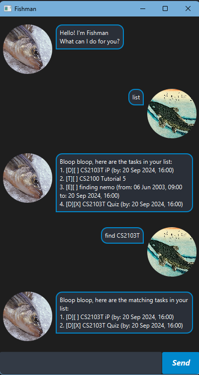

# Fishman User Guide



>From the seven seas, here comes a fish to remember your tasks for you! (_Does not have goldfish memory_)

## To use the application:
1. Download the latest release.
2. Double-click the `.jar` file or run the following command in the folder:
    ```
    java -jar fishman.jar
    ```
    
---

## Adding tasks

---
The application currently supports 3 types of tasks.
1. todo (basic task)
2. deadline (has option ```by``` to state the deadline of the task)
3. event (has options ```from``` and ```to``` to state event dates)

### Adding `todo`

```todo DESCRIPTION```

This command adds a ```todo``` task with the provided description.

**Example:**

```
todo Read a book
```
adds a task with the description "Read a book"

### Adding `deadline`

```deadline DESCRIPTION /by YYYY-MM-DD HHMM```

This command adds a ```deadline``` task with the provided description and a deadline.

>Dates must follow this format:
>* YYYY: 4-digit year
>* MM: 2-digit month (e.g., 01 for January)
>* DD: 2-digit day (e.g., 15 for the 15th)
>* HHMM: 4-digit time in 24-hour format (e.g., 1300 for 1:00 PM).
>* If the argument does not follow the above format, the command will return an error.

**Example:**

```
deadline CS2103T iP /by 2024-09-20 1600
```

adds a deadline task with the description "CS2103T iP" with the deadline by 19 Sep 2024, 4pm.

### Adding `event`

```event DESCRIPTION /from YYYY-MM-DD HHMM /to YYYY-MM-DD HHMM```

This command adds a ```event``` task with the provided description with the start and end dates as marked by 
from and to.

>Dates must follow this format:
>* YYYY: 4-digit year
>* MM: 2-digit month (e.g., 01 for January)
>* DD: 2-digit day (e.g., 15 for the 15th)
>* HHMM: 4-digit time in 24-hour format (e.g., 1300 for 1:00 PM).
>* If the argument does not follow the above format, the command will return an error.

**Example:**

```
event CS2103T Finals /from 2024-11-01 1600 /to 2024-11-01 1800
```

adds an event task with the description "CS2103T Finals" starting from 1 Nov 2024, 4pm to 1 Nov 2024, 6pm.

---

## Listing Tasks

### General listing

```list```

This command lists out all tasks that are currently saved in the task list.


### Find for specific tasks


```find TEXT```


This command finds all the tasks that contain the specified ```TEXT``` in their description.


**Example:**


```
find CS2103T
```


finds all the tasks containing "CS2103T" in its description.


---


## Updating Tasks


### Mark tasks


```mark NUMBER```


where ```NUMBER``` is the index of the tasks as per ```list``` command.

**Example:**

```
mark 1
```

marks the first task in the list as completed.


### Unmark tasks


``unmark NUMBER``


where ```NUMBER``` is the index of the tasks as per ```list``` command.


**Example:**


```
unmark 1
```

marks the first task in the list as incomplete.


### Delete tasks


```delete NUMBER```


where ```NUMBER``` is the index of the tasks as per ```list``` command.


**Example:**


```
delete 1
```


deletes the first task in the list.

---


## General operations

### Exit the application

```bye```

This command will exit the application.

### Persistent Storage

Fishman automatically saves your tasks, so there is no need to worry about losing them when you exit the application.
The next time you launch the application, all previously added tasks will be restored and ready for use!

---
