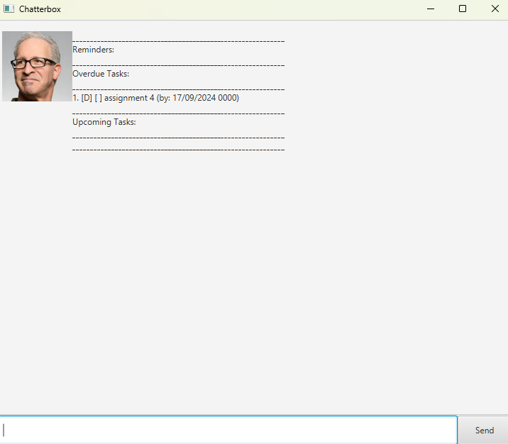

# Chatterbox User Guide

ChatterBox is a chatbot designed to help you manage your task.
The chatbot keeps your task saved in txt format and supports reminders when you open the application.

## Quick Start

1. Ensure you have Java 17 or above installed.
2. Download the latest .jar from the release.
3. Copy the file to the folder you use as the home folder for Chatterbox.
4. Open a terminal and run the application in the folder with java -jar chatterbox.jar
5. A GUI similar to this should appear.

6. Type the commands in the text box at the bottom.\
    Some commands you can try:
   1. list: List all existing task.
   2. todo <taskname>: Adds a simple todo task
   3. bye: Exits the application
7. Refer to the Features below for more details.

## Features
Notes about the command formats
* Items in <> are compulsory.\
eg. todo \<taskName> -> task name is compulsory
* Items in [] are optional.\
eg. deadline \<taskName> \by \<dd/MM/yyy> [HHmm] -> the time field is optional

### Viewing task list
Shows the existing task list stored in Chatterbox.\
Format: list

### Adding task (todo)
Adds a task with no time specification.\
Format: todo \<taskName>\
Examples:
* todo Assignment 1

### Adding task (deadline)
Adds a task with a complete by date/ time.\
Format: deadline \<taskName> /by <dd/MM/yyy> [HHmm]\
Examples:
* deadline Assignment 2 /by 12/12/2024
* deadline Assignment 2 /by 12/12/2924 1600

### Adding task (event)
Adds a task that has a start and end date/ time.\
Format: event \<taskName> /from <dd/MM/yyy> [HHmm] /to <dd/MM/yyy> [HHmm]\
Examples:
* event CS2103T Group Meeting /from 12/12/2024 1600 /to 12/12/2024 1700

### Marking and Unmarking task
Marking a task as completed or uncompleted. Mark for completed, unmark for uncompleted.\
You can get the task number with the List function. \
Format: mark\ unmark \<taskNumber>\
Examples:
* mark 1
* unmark 2

### Delete task
Deletes a task.
You can get the task number with the List function. \
Format: delete \<taskNumber>\
Examples:
* delete 1

### Find task
Find tasks based on the keyword provided.\
Format: find \<keyword>\
Examples:
* find Assignment

### Exiting the application
Exits the application.
Format: bye