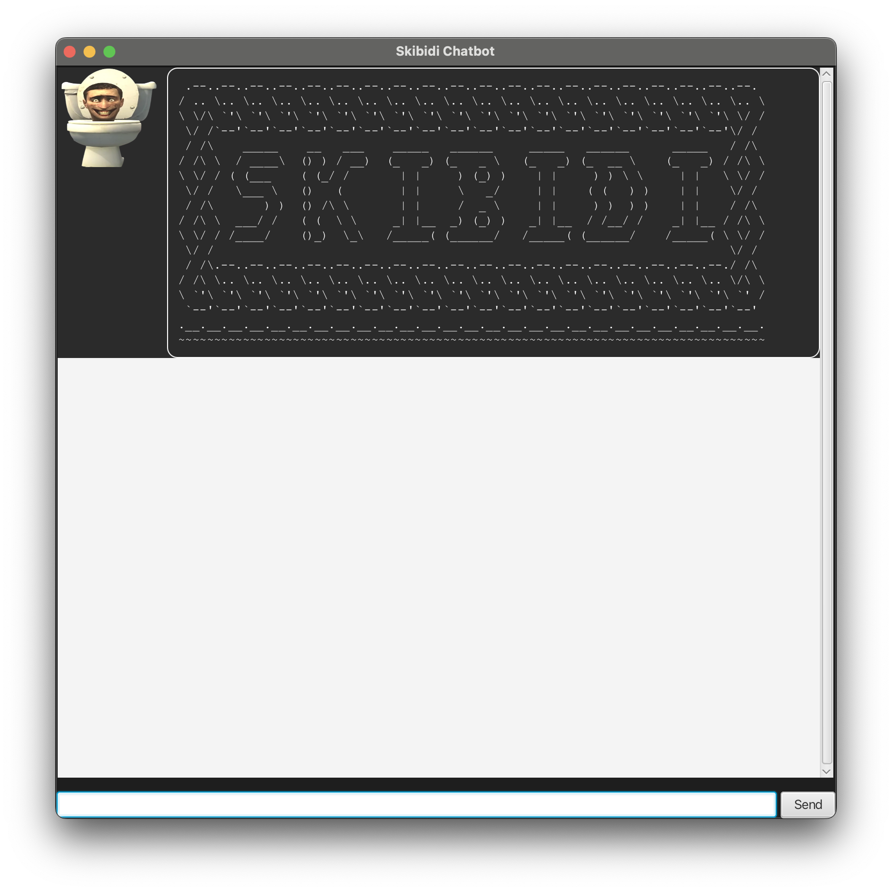

# Skbidi Chatbot User Guide


Skibidi chatbot is a **free** chatbot to help you remember the things you need to do in case your brain rots.

## Getting Started

Make sure you have Java 17 installed. Download the latest version of this program from the release page.

To start the program, run the command `java -jar skibidi.jar`. You should see the following screen:



## Features

### list

The `list` command prints the current list of tasks and their information.

### exit/bye

Both the `exit` and `bye` command can be used to leave the program.

### todo

The `todo` command is used to create new todo tasks. It requires a description argument.

```text
todo <description>
```

Example: `todo slides deck`

### deadline

A deadline is a task with the additional argument /by indicating the deadline of the task.

```text
deadline <description> /by <yyyy-mm-dd>
```

Example: `deadline project meeting /by 2024-09-22`

### event

An event has a start and end date indicated using the /from and /to arguments.

```text
event <description> /from <yyyy-mm-dd> /to <yyyy-mm-dd>
```

Example: `event tech hackathon /from 2024-09-10 /to 2024-09-20`

### mark/unmark

Todo, Deadline and Event entries can be marked and unmarked. Marked tasks are indicated with an `X` symbol.

```text
mark <task id>
unmark <task id>
```

### delete

Todo, Deadline and Event entries can be removed from the list using the delete command.

```text
delete <task id>
```

### find

The find command filters the tasks by whether the given query string is within the description of the task.

```text
find <query>
```

#### Example

For example, given the list of tasks:

```text
LISTING ITEMS:
    1. [E][ ][0] hackathon (from: 2024-09-09) (to: 2024-09-11)
    2. [D][ ][0] project slides submission (by: 2024-09-10)
    3. [T][X][0] read lecture notes for next week
```

If we run the command `find project slides`, we get the following output:

```text
SEARCH RESULTS:
    [D][ ][0] project slides submission (by: 2024-09-10)
```

### priority

When the `list` command is used, tasks are sorted in decreasing order of priority. The priority score can be any value you want. By default a task is given a priority score of 0. To change the priority score of a task, use the `priority` command.

For example, given the list of tasks:

```text
LISTING ITEMS:
    1. [E][ ][0] hackathon (from: 2024-09-09) (to: 2024-09-11)
    2. [D][ ][0] project slides submission (by: 2024-09-10)
    3. [T][X][0] read lecture notes for next week
```

To set the priority of the `project slides submission` to 5, run the following command:

```text
priority 2 5
```

When we run the `list` command again, this gives us the result:

```text
LISTING ITEMS:
    1. [D][ ][5] project slides submission (by: 2024-09-10)
    2. [E][ ][0] hackathon (from: 2024-09-09) (to: 2024-09-11)
    3. [T][X][0] read lecture notes for next week
```
