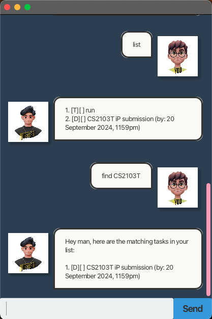

# JustBot :man: User Guide

> :muscle: **JustBot** takes the weight off your shoulders by keeping track of your tasks. It’s literally your bro, helping you navigate your day-to-day responsibilities!

**JustBot** is:
- text-based (u gotta bro language ***him***)
- easy to learn 
- ~~FAST~~ **SUPER FAST** to use
---
# Adding tasks 
There are **3 types of tasks** that JustBot can handle! 
1. `todo`
- Command: `todo [task description]`
- JustBot adds a _**ToDo**_ type task for you! 

2. `deadline` 
- Command: `deadline [task description] /by [dd/MM/yyyy HH:mm]`
- JustBot adds a _**Deadline**_ type task for you!

3. `event` 
- Command: `event [task description] /from [dd/MM/yyyy HH:mm] /to [dd/MM/yyyy HH:mm]`
- JustBot adds a _**Event**_ type task for you!

# Task Viewing
JustBot can display all your current tasks or provide details on a specific task with its description
1. `list`
- Command: `list`
- JustBot lists all the tasks for you (sorted in chronological order!)
2. `find` 
- Command: `find [task description]`
- JustBot returns you tasks matching the task description you provided him

# Task Management 
JustBot can help you delete, mark and unmark your tasks 
1. `delete`
- Command: `delete [task number]`
- JustBot deletes the task of the corresponding number you provided him 
2. `mark`
- Command: `mark [task number]`
- JustBot marks the task of the corresponding number as complete 
3. `unmark`
- Command: `unmark [task number]`
- Justbot unmarks the task of the corresponding number as incomplete 

# Closing JustBot 
When it is time to part ways with JustBot 
1. `bye`
- Command: `bye` 
- Closes JustBot after 2 secs 
---
# JustBot in action! 

