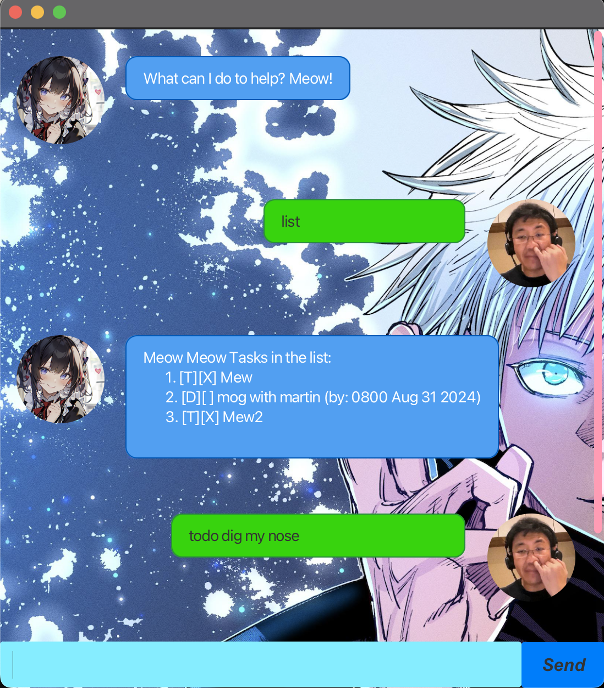

# Meow chatbot user guide


Are you feeling lonely? Love cat girls? Hate being disorganised?
Here is where the meow chatbot comes in !!! It helps you organise
all your tasks from todo to events incoming !!!

## Adding deadlines
You can add deadline task via the deadline command
it requires an additinal input

Example: `deadline <taskname> /by <time>`

Do make sure that time is formatted correctly as
`YYYY-MM-DD HHmm`

Expected outcome is that a new deadline task is added and meow informs you

```
expected output
```

## Adding Events

You can add Events task via the event command
it requires an additinal input

Example: `event <eventName> /from <time> /to`

Do make sure that time is formatted correctly as
`YYYY-MM-DD HHmm`

Expected outcome is that a new deadline task is added and meow informs you

```
expected output
```


## Update feature

You can update specfic details for existing tasks. Via the update command

For Todo tasks: `update <taskname> /new <data>`
For Other tasks: `update <taskname> /<characteristic to change> /new <new data>`

For example: `update Do CS1231S HW /name /new Do CS1231S Assignment`

Do make sure that time is formatted correctly as
`YYYY-MM-DD HHmm`

Expected outcome is that a new deadline task is added and meow informs you

```
expected output
Task Do CS1231S HW is now changed to Do CS1231S Assignment
```


## Listing feature
You can see all available current tasks. This displays all relevant fields related to each task.
Such as, description, type of task, time, completion. 

Example: `list`


Expected outcome is that displays list of available tasks

```
Meow Meow you have 2 tasks!
    [E][ ] Party (from: 1000 17 AUG 2023 to: 1000 17 AUG 2023)
    [T][X] Eat dinner
```


## Marking feature
You can mark an existing task via its index as complete

Example: `mark 1`


Expected outcome is that marks the corresponding task as done

```
Meow Meow I marked this as done!
    [T][X] Mewwing
```

## Unmarking feature
You can unmark an existing task via its index as uncompleted

Example: `unmark 1`

Expected outcome is that it unmarks the corresponding task as undone

```
Meow Meow I unmarked this as done!
    [T][ ] Mewwing
```

## Find featureYou can add deadline task via the deadline command
You can find all task descriptions which contain the inputted string

Example: `find mew`


Expected outcome is that returns all existing tasks

```
Meow Meow found these tasks:
    [T][ ] mewwing with Martin
    [T][ ] mew Maxxing
    [T][X] mew
```