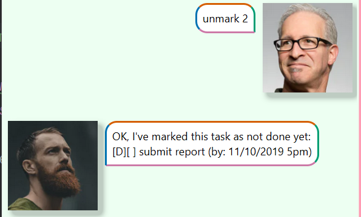

# ChattyBuddy User Guide

ChattyBuddy is a personal task management and productivity assistant built using Java and JavaFX. It allows users to manage tasks such as todos, deadlines, and events via a simple chat-like interface. ChattyBuddy helps you organize your tasks and keeps track of your progress, whether it's marking tasks as done, undoing actions, or retrieving previously saved tasks.

## Usage Examples

There are several command keywords: `todo`, `deadline`, `event`, `mark`, `unmark`, `list`, `delete` and `undo` and `bye`.

---
## Display list of tasks

After entering different tasks such as todos and deadlines, they will be saved to the
local storage. The users could retrieve by entering `list`

E.g. 

---
## Mark/Unmark tasks

The users could mark/unmark a certain task as done/not done.

Format: `mark/unmark (index of the task)`

E.g.

---
## Add a Todo task

The users could store a todo task to the chatbot.

Format: `todo (description of the task)`

E.g.

---
## Add a Deadline task

The users could store a deadline task to the chatbot.

Format: `todo (description of the task) /by (date)`

E.g.

---
## Add an Event task

The users could store an event task to the chatbot.

Format: `event (description of the task) /from (start date) /to (end date)`

Note: If no exact time is specified, the system will automatically set it to 12am

E.g.

---
## Delete tasks

The users could delete a certain task by entering the index of the task

Format: `delete (index of the task)`

E.g.

---
## Undo command

The users could undo their previous command (except for list and bye)

They could either enter `undo` which indicates that they only want to undo once

or they could enter `undo (number)` to indicate the number of times they want to undo the previous commands

E.g.

---
## Exit the application

To exit the application, user just need to enter `bye` and after 3 seconds the application will automatically end.