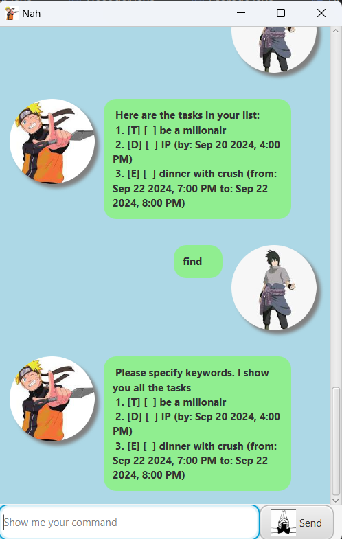

# Nah

Meet Nah, your dedicated chatbot assistant for managing daily 
tasks, deadlines, and events. Designed to streamline your 
schedule and keep you on top of your commitments, Nah
makes organizing your life simpler and more efficient. 

- [Quick Start](#quick-start)
- [Features and Commands](#nah-supports-the-following-features)
    - [Adding Todo tasks: `ToDo`](#1-adding-a-to-do-task)
    - [Adding Deadline tasks: `DeadLine`](#2-adding-a-deadline)
    - [Adding Event tasks: `Event`](#3-adding-an-event)
    - [Finding matching tasks: `Find`](#4-find-matching-tasks)
    - [Finding tasks before a due: `DueOn`](#5-find-task-before-a-due)
      [Marking task as done: `Mark`](#6mark-a-task-as-done)
    - [Marking task as not done: `Mark`](#7unmark-a-task-mark-a-task-as-not-done)
    - [Deleting a task: `Delete`](#8delete-a-task)
    - [Viewing the task list: `List`](#9-view-all-the-task)
    - [Clean all the tasks: `Clean`](#10-clean-all-the-task)
    - [Open a Help Window: `Help`](#11-open-a-help-window)
    - [Exit the program: `Bye`](#12-exit-the-program)
    - [Other unique interaction](#13-and-other-special-interaction)
- [FAQ](#faq)
- [Known Issue](#known-issues)
- [Command Summary](#command-summary)

# Quick Start
. Ensure you have Java `17` or above installed in your Computer.

1. Download the latest `.jar` file from [here](https://github.com/blackpanther9229/releases).

1. Copy the file to the folder you want to use as the _home folder_ for your AddressBook.

1. Open a command terminal, `cd` into the folder you put the jar file in, and use the `java -jar addressbook.jar` command to run the application.<br>
   A GUI similar to the below should appear in a few seconds. Note how the app contains some sample data.<br>
   

1. Type the command in the command box and press Enter to execute it. e.g. typing **`help`** and pressing Enter will open the help window.<br>
   Some example commands you can try:

    * `list` : Lists all contacts.

    * `Todo Sleep` : Add a new `Todo` task to sleep in the current list. 

    * `delete 3` : Deletes the 3rd task shown in the current list.

    * `clean` : Deletes all contacts.

    * `bye` : Exits the app.

1. Refer to the [Features](#nah-supports-the-following-features) below for details of each command.

--------------------------------------------------------------------------------------------------------------------

## Nah Supports the Following Features:

> [!NOTE]
> Notes about the syntax format:
> - Words in single quotation mark `''` are the parameters to be supplied by the user.<br>
  The parameters should follow the guide in the single quotation mark.<br>
  e.g. in `Todo 'Description'`, `'Description` is a parameter which can be used as `Todo Sleep`.
> - Extra arguments in most of the commands type will be interpreted as wrong format error.

### 1. Adding a To-do task

To add a To-do to the storage, use the following format: 

`Todo 'Description'`

Example: `Todo be a milionair`

```
 Got it. I've added this task: 
   [T] [ ] be a milionair
 Now you have 1 tasks in the lists.
```

### 2. Adding a Deadline

To add a Deadline to the storage, use the following format:

`Deadline 'Description' /by 'yyyy-mm-dd HHmm'`

Example: `Deadline IP /by 2024-09-20 1600`

Response:
```
 Got it. I've added this task: 
   [D] [ ] IP (by: Sep 20 2024, 4:00 PM)
 Now you have 2 tasks in the lists.
```


### 3. Adding an Event

To add an Event to the storage, use the following format:

`Event 'Description' /from 'yyyy-mm-dd HHmm' /to 'yyyy-mm-dd HHmm'`

Example: `Event dinner with crush /from 2024-09-22 1900 /to 2024-09-22 2000`

Response:
```
 Got it. I've added this task: 
   [E] [ ] dinner with crush (from: Sep 22 2024, 7:00 PM to: Sep 22 2024 8:00 PM)
 Now you have 2 tasks in the lists.
```

### 4. Find matching tasks

To find matching tasks for some keywords, use the following format:

`Find 'one or more key words'`

* The search is case-insensitive. e.g `Oke` will match `oke`
* Non-space word will be used to search. e.g `Oke eko` will be divided to `Oke` and `eko` to search
* Only full words will be matched e.g. `Oke` will not match `Ok`

Example:
`Find dinner lunch`

Response: 
```
  Oke. Here are the task that match the keywords:
  3. [E] [ ] dinner with crush (from: Sep 22 2024, 7:00 PM to: Sep 22 2024 8:00 PM)
```
The response can be interpreted as follows:
- Event type (`T` is a Todo, `E` is an Event and `D` is a deadline)
- Status (`[X]` for completed, `[ ]` otherwise)
- Description
- Start and end dates (if applicable) in `MMM d yyyy, h:mm a` format

> [!NOTE]
> If your key word is space, the chatBot will just show you all the task list.<br>



### 5. Find task before a due

To find all deadlines or events before due , use the following format:

`Dueon yyyy-mm-dd HHmm`

Example:
`Dueon 2024-10-10 2400`

Response:
```
  Here are the tasks in your list that end before the end date:
  2. [D] [ ] IP (by: Sep 20 2024, 4:00 PM)
  3. [E] [ ] dinner with crush (from: Sep 22 2024, 7:00 PM to: Sep 22 2024 8:00 PM)
```

### 6.Mark a task as done

To mark a task as done, use the following format:

`Mark 'ordinal number of the task'`

* Mark at the specified `index`.
* The index refers to the index number shown in the displayed tasks list.
* The index **must be a positive integer** 1, 2, 3, …​

Example: 
`Mark 2`

Response:
```
 Nice. I've marked this task as done:
   [D] [X] IP (by: Sep 20 2024, 4:00 PM)
```

### 7.Unmark a task/ Mark a task as not done

To Unmark a task as done, use the following format:

`Unmark 'ordinal number of the task'`

* Unmark at the specified `index`.
* The index refers to the index number shown in the displayed tasks list.
* The index **must be a positive integer** 1, 2, 3, …​

Example:
`Unmark 2`

Response:
```
 Oke. I've marked this task as not done:
   [D] [ ] IP (by: Sep 20 2024, 4:00 PM)
```

### 8.Delete a task

To delete a task, use the following format:

`Delete 'index'`

* Deletes the task at the specified `index`.
* The index refers to the index number shown in the displayed tasks list.
* The index **must be a positive integer** 1, 2, 3, …​

Example:
`Delete 2`

Response:
```
 Noted. I've removed this task as not done:
   [D] [ ] IP (by: Sep 20 2024, 4:00 PM)
 Now you have 2 tasks in the list
```
> [!NOTE]
> After a task is deleted, the remaining tasks will be automatically renumbered.<br> 
> E.g: task list has 3 tasks with index 1, 2, 3, after deleting task 2, old task 3 will become new task 2.

### 9. View all the task

To view all the tasks, use the following command:

`List`

Response Example:
```
  Here are the tasks in your list:
  1. [T] [ ] be a milionair
  2. [E] [ ] dinner with crush (from: Sep 22 2024, 7:00 PM to: Sep 22 2024 8:00 PM)
```

### 10. Clean all the task

To clean al the tasks, use the following command:

`Clean`

* This command is still irreversible in this Nah version, so be careful.<br>
    `Great power comes great responsibility`

Response Example:
```
 Got it. I've cleaned the storage. 
 Now you have no tasks in the list.
```

### 11. Open a help Window

To open the help Window, use the following command:

`Help`

The chatBot will response: `Openning Help Window`

And a helping window will show up after 1 second


### 12. Exit the program

To exit the program, use the following command:

`Bye`

The program will shut down after 1 second

### 13. And other special interaction

Try the command format start with `Hi`, `Hello`, `Oke`, `Yo` or `Nah` to explore unique features of this chatbot

--------------------------------------------------------------------------------------------------------------------
## FAQ

**Q**: What if I type `Help` to the chatBot more than 2 times without closing the Help Window?<br>
**A**: Only one HelpWindow is opened. Second `Help` command won't open second Help Window.


--------------------------------------------------------------------------------------------------------------------
## Known issues

1. **Command Overwriting**, If users attempt to add a task with the same description as an existing one, the app does not prevent duplicates. Users should manage their tasks accordingly.
2. **GUI resizing**, User should not resize the screen windows, as this version has not supported this.

--------------------------------------------------------------------------------------------------------------------
## Command Summary

Action                        | Format, Examples                                                                                                                      |
------------------------------------|---------------------------------------------------------------------------------------------------------------------------------------|
**Add To-do**                      | `Todo 'Description'`<br> e.g., `Todo Sleep`                                                                                           |
**Add Deadline**                   | `Deadline 'Description' /by 'yyyy-mm-dd HHmm'`<br> e.g., `Deadline IP /by 2024-09-20 1600`                                            |
**Add Event**                      | `Event 'Description' /from 'yyyy-mm-dd HHmm' /to 'yyyy-mm-dd HHmm'`<br> e.g., `Event dinner /from 2024-09-22 1900 /to 2024-09-22 2000` |
**Find Matching Tasks**            | `Find 'one or more key words'`<br> e.g., `Find dinner`                                                                                |
**Find Tasks Before a Due Date**    | `Dueon 'yyyy-mm-dd HHmm'`<br> e.g., `Dueon 2024-10-10 2400`                                                                           |
**Mark Task as Done**              | `Mark 'ordinal number of the task'`<br> e.g., `Mark 2`                                                                                |
**Unmark Task (Mark as Not Done)**  | `Unmark 'ordinal number of the task'`<br> e.g., `Unmark 2`                                                                            |
**Delete Task**                    | `Delete 'ordinal number of the task'`<br> e.g., `Delete 2`                                                                            |
**View All Tasks**                 | `List`                                                                                                                                 |
**Clean All Tasks**                | `Clean`                                                                                                                               |
**Open Help Window**               | `Help`                                                                                                                                |
**Exit Program**                   | `Bye`                                                                                                                                 |
**Special Interaction**            | `Hi`, `Hello`, `Oke`, `Yo`, `Nah`                                                                                                     |
