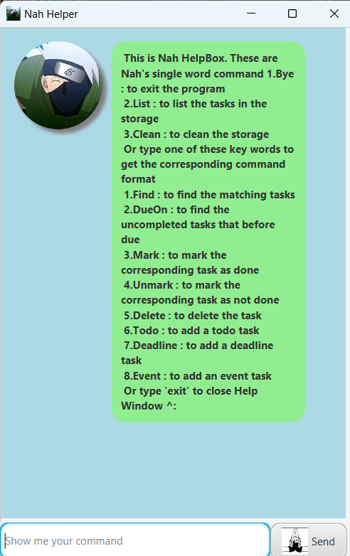

# Nah User Guide


Meet Nah, your dedicated chatbot assistant for managing daily 
tasks, deadlines, and events. Designed to streamline your 
schedule and keep you on top of your commitments, Nah
makes organizing your life simpler and more efficient. 

## Nah Supports the Following Features:

### 1. Adding a To-do task

To add a To-do to the storage, use the following command: 

`Todo 'Description'`

Example: `Todo be a milionair`

```
 Got it. I've added this task: 
   [T] [ ] be a milionair
 Now you have 1 tasks in the lists.
```

### 2. Adding a Deadline

To add a Deadline to the storage, use the following command:

`Deadline 'Description' /by yyyy-mm-dd HHmm`

Example: `Deadline IP /by 2024-09-20 1600`

Response:
```
 Got it. I've added this task: 
   [D] [ ] IP (by: Sep 20 2024, 4:00 PM)
 Now you have 2 tasks in the lists.
```


### Adding an Event

To add an Event to the storage, use the following command:

`Event 'Description' /from yyyy-mm-dd HHmm /to yyyy-mm-dd HHmm`

Example: `Event dinner with crush /from 2024-09-22 1900 /to 2024-09-22 2000`

Response:
```
 Got it. I've added this task: 
   [E] [ ] dinner with crush (from: Sep 22 2024, 7:00 PM to: Sep 22 2024 8:00 PM)
 Now you have 2 tasks in the lists.
```

### 4. Find matching tasks

To find matching tasks, use the following command:

`Find 'one or more words'`

Example:
`Find dinner`

Response: 
```
  Oke. Here are the task that match the keywords:
  3. [E] [ ] dinner with crush (from: Sep 22 2024, 7:00 PM to: Sep 22 2024 8:00 PM)
```

### 5. Find task before a due

To find all deadlines or events before due , use the following command:

`Dueon yyyy-mm-dd HHmm`

Example:
`Dueon 2024-10-10 2400`

Response:
```
  Here are the tasks in your list that end before the end date:
  2. [D] [ ] IP (by: Sep 20 2024, 4:00 PM)
  3. [E] [ ] dinner with crush (from: Sep 22 2024, 7:00 PM to: Sep 22 2024 8:00 PM)
```

### 6.Mark a task as done

To mark a task as done, use the following command:

`Mark 'ordinal number of the task'`

Example: 
`Mark 2`

Response:
```
 Nice. I've marked this task as done:
   [D] [X] IP (by: Sep 20 2024, 4:00 PM)
```

### 7.Unmark a task/ Mark a task as not done

To Unmark a task as done, use the following command:

`Unmark 'ordinal number of the task'`

Example:
`Unmark 2`

Response:
```
 Oke. I've marked this task as not done:
   [D] [ ] IP (by: Sep 20 2024, 4:00 PM)
```

### 8.Delete a task

To delete a task, use the following command:

`Delete 'ordinal number of the task'`

Example:
`Delete 2`

Response:
```
 Noted. I've removed this task as not done:
   [D] [ ] IP (by: Sep 20 2024, 4:00 PM)
 Now you have 2 tasks in the list
```

### 9. List all the task

To list all the tasks, use the following command:

`List`

Response Example:
```
  Here are the tasks in your list:
  1. [T] [ ] be a milionair
  2. [E] [ ] dinner with crush (from: Sep 22 2024, 7:00 PM to: Sep 22 2024 8:00 PM)
```

### 10. Clean all the task

To clean al the tasks, use the following command:

`Clean`

Response Example:
```
 Got it. I've cleaned the storage. 
 Now you have no tasks in the list.
```

### 11. Open a help Window

To open the help Window, use the following command:

`Help`

A helping window will show up 



### 12. Exit the progeam

To exit the program, use the following command:

`Bye`

The program will shut down after 1 second

### 13. And other special interaction

Try the command format start with `Hi`, `Hello`, `Oke`, `Yo` or `Nah` to explore unique features of this chatbot