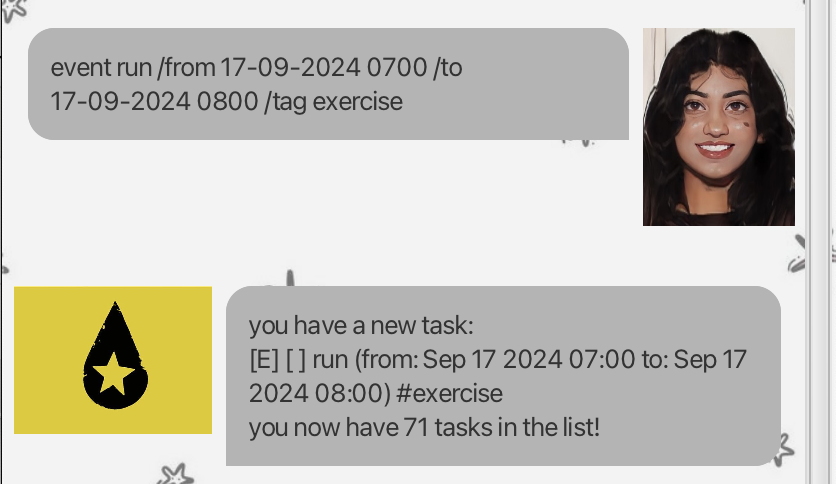
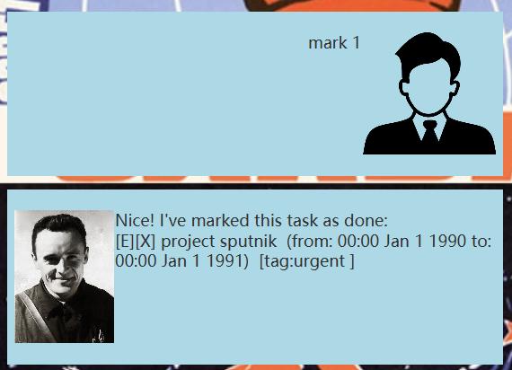

# PandaBot User Guide

> "_Productivity is never an accident. It is always the result of a commitment to excellence, intelligent planning, and focused effort._" – Paul J. Meyer [(source)](https://dansilvestre.com/productivity-quotes/)

Prerequisites: JDK 17.
- **For Windows Users:** [Oracle Version](https://www.oracle.com/java/technologies/downloads/#java17)
- **For Mac Users:** [JDK 17 (Azul)](https://se-education.org/guides/tutorials/javaInstallationMac.html)

PandaBot frees your mind from remembering tasks and lets you focus on what truly matters. It's:

- **text-based**
- **easy to use**
- **FAST** 🚀

## Table of Contents
1. [Getting Started](#getting-started)
2. [Features](#features)
    - [Viewing Help : `help`](#viewing-help--help)
    - [Add a Todo : `todo`](#add-a-todo--todo)
    - [Add a Deadline : `deadline`](#add-a-deadline--deadline)
    - [Add an Event : `event`](#add-an-event--event)
    - [List All Tasks : `list`](#list-all-tasks--list)
    - [Mark a Task as Done : `mark`](#mark-a-task-as-done--mark)
    - [Unmark a Task as Done : `unmark`](#unmark-a-task-as-done--unmark)
    - [Delete Tasks : `delete`](#delete-tasks--delete)
    - [Find Tasks by Keyword : `find`](#find-tasks-by-keyword--find)
    - [Exiting PandaBot : `bye`](#exiting-pandabot--bye)

### Getting Started

1. Ensure you have Java `17` or above installed in your Computer.
2. Download the latest PandaBot.jar file from [here](https://github.com/adipanda2002/ip/releases).
3. Place the file into the folder you want to use as the _home folder_ for PandaBot.
4. Open a command terminal, `cd` into the folder you put the jar file in, and use the `java -jar PandaBot.jar` command to run the application.
   A GUI similar to the below should appear in a few seconds.
   
5. Type the command in the command box and press Enter to execute it. e.g. typing `help` and pressing Enter will open the help window.
6. Refer to the [Features](#features) below for details of each command

# Features:

## Viewing help : `help`
Shows a help message with instructions on command formats.

Format: `help`

## Add a todo : `todo`
Adds a new task with the given description to your list.

Format: `todo <description>`

Examples:
- `todo plan presentation`
- `todo wash the dishes`

### Add a deadline : `deadline`
Adds a new task with the given description and deadline to your list.

Format: `deadline <description> /by <DD/MM/YYYY HHmm>`

Examples:
- `deadline math homework /by 20/09/2024 2359`
- `deadline ethics essay /by 21/10/2024 1200`

## Add an event : `event`
Adds a new event with the given description, start and end dates/times to your list.

Format: `event <task description> /from <DD/MM/YYYY HHmm> /to <DD/MM/YYYY HHmm>`

Note that the end date/time must be after the start date/time

Examples:
- `event f1 race /from 22/09/2024 2000 /to 22/09/2024 2200`
- `event mum's bday celebration /from 27/09/2024 1800 /to 27/09/2024 2000`

## List all tasks : `list`
Lists all the tasks currently in your list.

Format: `list`

## Mark a task as done : `mark`
Marks the selected task as done with an 'X'

Format: `mark <task number>`

Examples:
- `mark 2`
- `mark 1`

Note that the task number input must be smaller than or equal to the number of tasks in your list.

## Unmark a task as done : `unmark`
Unmarks the selected task on the list.

Format: `unmark <task number>`

Examples:
- `unmark 2`
- `unmark 1`

Note that the task number input must be smaller than or equal to the number of tasks in your list.

## Delete tasks : `delete`
Deletes the selected task from the list.

Format: `delete <task number>`

Examples:
- `delete 2`
- `delete 1`

Note that the task number input must be smaller than or equal to the number of tasks in your list.

## Find tasks by keyword : `find`
Find tasks containing the text following the command `find`.

Format: `find <keyword>`

Examples:
- `find wash`
- `find race`

## Exiting PandaBot : `bye`
Saves your tasks and exits the PandaBot.

Format: `bye`

This user guide aims to be as concise as possible, while still providing enough detail for you to use all the key features of PandaBot. If you need further clarification on any of the commands, feel free to type `help` in PandaBot.

For more complex operations, refer to specific sections of this user guide.

