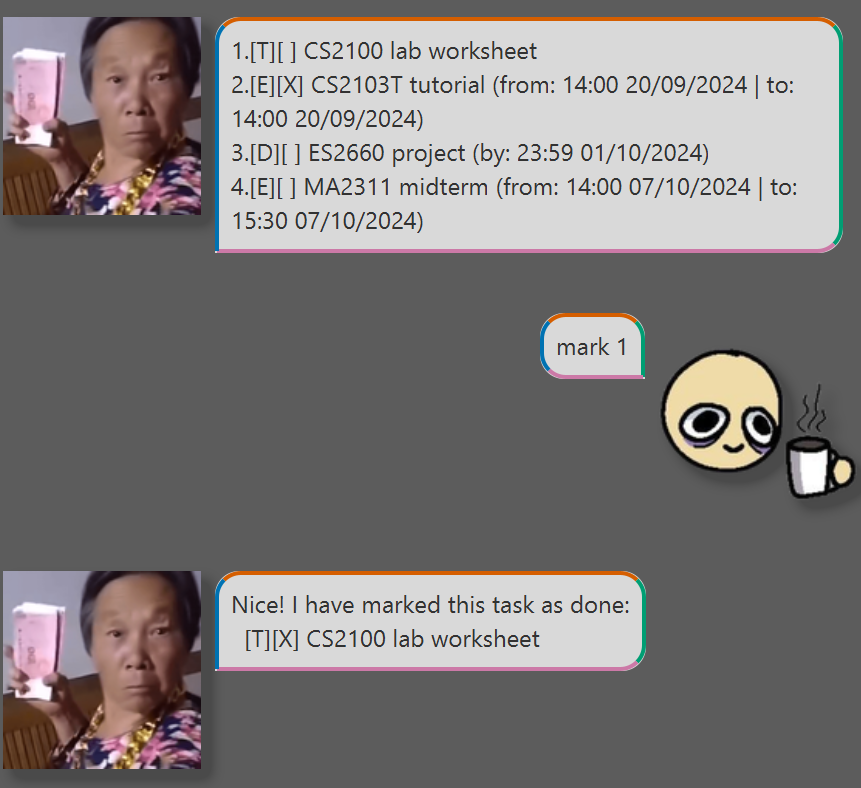

# MrYapper User Guide

MrYapper is a ChatBot designed to help you manage your tasks and keep track of which tasks you have completed.

You may type your command in the text box below and click the `Send` button 
(or press `Enter`) to execute the command.
All tasks are saved locally so no internet is required!

# Features

## List all tasks: `list`

Displays all the tasks in the list.

Format: `list`

## Add a todo task: `todo`

Adds a todo task into your task list.

Format: `todo DESCRIPTION`
- Adds a todo task with the given `DESCRIPTION`.

Examples:
- `todo CS2103T iP` adds a todo task with the description `CS2103T iP`.

## Add a task with deadline: `deadline`

Adds a task with deadline into your task list.

Format: `deadline DESCRIPTION /by DEADLINE`
- Adds the deadline with the given `DESCRIPTION`.
- The deadline of the task is the specified `DEADLINE`.
- `DEADLINE` has to be in a proper format with date and time e.g. `11:24 8-12-2012`, `1934 24/1/2000`.
- When MrYapper displays `DEADLINE`, the format of the date and time will be set to **HH:mm dd/MM/yyyy**.

Examples:
- `deadline CS2100 assignment 13:00 1/9/2024` will create a task 
`CS2100 assignment` with deadline at `13:00 01/09/2024`.
- `deadline ES2660 project /by 2359 1-10-2024` will create a task 
`ES2660 project` with deadline at `23:59 01/10/2024`.

## Add an event: `event`

Adds an event into your task list.

Format: `event DESCRIPTION /from START /to END`
- Adds an event with the given `DESCRIPTION`.
- The event lasts from `START` to `END`.
- `START` and `END` has to be in a proper format with date and time e.g. `11:24 8-12-2012`, `1934 24/1/2000`.
- When MrYapper displays `START` and `END`, the format of the date and time will be set to **HH:mm dd/MM/yyyy**.

Examples:
- `event ES2660 lesson /from 09:00 20-9-2024 /to 12:00 20-9-2024` will create an event 
`ES2660 lesson` which lasts from `09:00 20/09/2024` to `12:00 20/09/2024`.
- `event CS2103T tutorial /from 1400 20/9/2024 /to 1500 20/9/2024` will create an event 
`CS2103T tutorial` which lasts from `14:00 20/09/2024` to `15:00 20/09/2024`.

## Delete a task: `delete`

Deletes a task from the task list.

Format: `delete INDEX`
- Deletes the task at the specified `INDEX` of the task list, counting from 1.

Examples:
- `delete 4` deletes the task with the index of 4.

## Edit a task: `edit`

Edits the single detail of a task.

Format: `edit INDEX /PARAMETER UPDATED_DETAIL`
- Edits the task at the specified `INDEX` of the task list, counting from 1.
- `PARAMETER` is the parameter of the task to be edited.
  - `PARAMETER` can by `/description`, `/by`, `/from` or `/to`
  - `PARAMETER` must be an actual parameter of the task e.g. `PARAMETER` cannot be `/by` if the task is a todo task.
- `UPDATED_DETAIL` is the string you want to change the parameter to.
- `UPDATED_DETAIL` has to be in a proper format with date and time if it is a date or time 
e.g. `11:24 8-12-2012`, `1934 24/1/2000`.

Examples:
- `edit 2 /description CS2100 tutorial worksheet` edits the description of the task at 
index 2 to `CS2100 tutorial worksheet`.
- `edit 1 /by 2359 23/9/2024` if the task at index 1 is a task with deadline, this edits 
the deadline of the task to `23:59 23/09/2024`.
- `edit 4 /to 1530 7-10-2024` if the task at index 4 is an event, this edits the 
end date and time of the event to `15:30 07/10/2024`.

## Find a task: `find`

Searches for the task based on the keywords of the given description.

Format: `find DESCRIPTION`
- Finds a task based on the keywords in specified `DESCRIPTION`.
- Task description needs to contain every keyword present in `DESCRIPTION`.
- Keywords in `DESCRIPTION` are case-insensitive.
- The keywords have to match exactly.

Examples:
- `find CS2103T` searches for any tasks containing `CS2103T` (case-insensitive).
- `find cs2100 LaB` searches for any task containing `cs2100` and `LaB` (case-insensitive).

## Mark a task: `mark`

Marks a task as done. Tasks that are marked as done are marked with `[X]` when displayed.

Format: `mark INDEX`
- Marks the task with the specified `INDEX` (counting from 1) as done.

Examples:
- `mark 1` marks the task at index 1 as done.

## Unmark a task: `unmark`

Marks a task as **not** done. Tasks that are marked as not done are marked with `[ ]` when displayed.

Format: `unmark INDEX`
- Marks the task with the specified `INDEX` (counting from 1) as not done.

Examples:
- `unmark 1` marks the task at index 1 as not done.

## Exit the ChatBot: `bye`

Says goodbye to the ChatBot and closes the ChatBot a few seconds later.

Format: `bye`
- Any words or parameters included are ignored.

