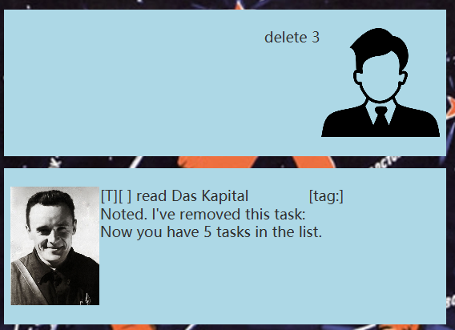

# Blue Chatbot User Guide


# Introduction

Welcome to Blue Chatbot! - your personal assistant for managing tasks efficiently. 
Blue helps you keep track of your to-do items, deadlines, and events with 
ease. You can add tasks, set deadlines, schedule events, mark tasks as done or undone, 
delete tasks, and avoid duplicates—all through simple text commands.

## Adding Todo Tasks

Use the **todo** keyword followed by the task description 


Example: `todo homework`


Expected Output
```
Task added: todo homework. 
Now you have 1 task.
```

## Adding Deadline Tasks

Use the **deadline** keyword followed by the task description and a 
**/by** keyword followed by the deadline in the format **DD-MM-YYYY 0000hr** format to
add a task with a deadline

Example: `deadline homework /by 2/10/2024 2300`


Expected Output
```
Task added: deadline homework /by 
2/10/2024 2300. 
Now you have 2 tasks.
```


## Adding Event Tasks

Use the **event** keyword followed by the task description and a
**/from** keyword followed by the start time in the format **DD-MM-YYYY 0000hr** format and 
**/to** keyword followed by the end time in the format **DD-MM-YYYY 0000hr** format to 
add an event task.

Example: `event Alastor's Birthday Party /from 15/9/2024 1800 /to 15/9/2024 2359`


Expected Output
```
Task added: event Alastor's Birthday Party /from 
15/9/2024 1800 /to 15/9/2024 2359. 
Now you have 3 tasks.
```


## Listing all tasks

Use the **list** keyword to display all the tasks.

Example: `List`


## Mark a task as done

Use the **mark** keyword followed by the task number
to mark a task as done

Example: `mark 1`


Expected Output
```
Nice! I've marked this task as done:
[T] [ ] run 10km
```

## Unmark a task

Use the **unmark** keyword followed by the task number
to unmark a task.

Example: `unmark 1`


Expected Output
```
OK, I've marked this task as not done yet:
[T] [ ] run 10km
```

## Deleting a task

Use the **delete** keyword followed by the task number
to delete a task.

Example: `delete 1`



Expected Output
```
Noted. I've removed this task:
[T] [ ] run 10km
Now you have 2 tasks in the list
```

## Finding Tasks

Use the **Find** keyword followed by the keyword you want 
matched to find tasks.

Example: `find CS`


Expected Output
```
Here are the matching tasks in your list:
1. [T] [ ] CS2105 Assignment
2. [D] [ ] CS2100 Quiz (by:Oct 10 2024 23:59)
3. [D] [ ] CS2103 Peer Review (by: Sept 20 2024 18:00)
```

## Detecting Duplicates

The bot has a feature to detect duplicate tasks and 
will not add them to the list.


Expected Output if duplicate entries detected
```
Duplicate task entry detected.
```


