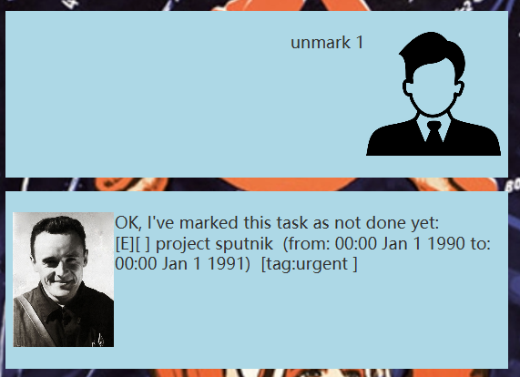
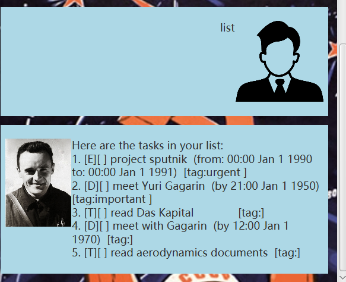

# Hien User Guide

Hien is a chatbot application for task management that tracks your daily tasks on a Graphical User Interface (GUI). The chatbot supports various functions to help you manage your tasks efficiently.

## Features

### Adding deadlines

This command helps you add your upcoming deadline to your current tasks list.

Format: `deadline <your_deadline_description> /by <due_date>`

`<due_date>` is in yyyy-MM-dd HHmm format.

Example: `deadline homework /by 2024-09-24 2359`

Expected output: Deadline added to the task list and a response with deadline description:

### Adding todos

This command helps you add a todo action to the current task list.

Format: `todo <description>`

Example: `todo laundry`

Expected output: Todo action added to the task list and a response with action description:

### Adding events

This command allows you to add events to your task list.

Format: `event <description> /from <from_date> /to <to_date>`

Example: `event team meeting /from 2024-09-25 1400 /to 2024-09-25 1600`

Expected output: Event added to the task list and a response with event description:

### Marking tasks as done

You can mark tasks as completed using this command.

Format: `mark <task_index>`

Example: `mark 1` (marks the first task of the list as done)

Expected output: The task is marked with a response.

### Unmarking tasks

If you need to change a task back to incomplete, use this command.

Format: `unmark <task_index>`

Example: `unmark 1` (unmarks the first task of the list)

Expected output: The task is unmarked with a response.

### Listing tasks

To view all current tasks, use the following command:

Format: `list`

Expected output: A message with all current tasks.

### Finding tasks

You can search for tasks based on keywords, even if the keyword matches the item only partially.

Format: `find <keyword>`

Example: `find home`

Expected output: A message with one or more tasks that has description match with the keyword.

### Deleting tasks

You can delete individual tasks or all tasks at once.

To delete a single task:

Format: `delete <task_index>`

Example: `delete 2` (deletes the second task of the list)

To delete all tasks:

Format: `deleteAll`

## Close the application

Terminates the application.

Example: `bye`

Expected outcome: The application is terminated.

