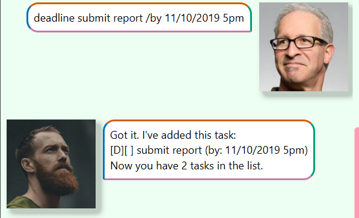

# Pebble User Guide 🪨 🪨
- Task management chat bot to track your tasks
- ALL tasks are auto saved locally in your computer!
- You can find the source code [here](https://github.com/slidings/ip)

## Main Features
1) Types of tasks to be tracked includes ToDos, Deadlines, Events 
2) Includes basic functionalities to manage the tasks

### 1a) Todo
ToDos are essentially tasks without any date/time attached to it

Example: `todo <task name>`

### 1b) Deadlines
Deadlines are tasks that need to be done before a specific date/time

Example: `deadline <task name> /by <when>`

### 1c) Events
Events are tasks that start at a specific date/time and ends at a specific date/time

Example: `event <task name> /from <when> /to <when>`

### 2a) List
This lists all the tasks that are added to pebble

Example: `list`

### 2b) Mark
This marks a specific task as "done", indicated by the [X]

Example: `mark <task number>`

### 2c) Unmark
This unmarks a specific task, and is indicated by an empty box [ ]

Example: `unmark <task number>`

>[!TIP]
> Marking a marked task and unmarking an unmarked task will not do anything

### 2d) Delete
This deletes a specific task

Example: `delete <task number>`

### 2e) Find
This allows user to filter the list of task by a keyword

Example: `find <keyword>`

### 2f) Bye
This bids goodbye to pebble and will exit the program

Example: `bye`

### _*Newest patch: Friendlier syntax*_
Improved support for friendlier command syntax and shortcuts

In addition to `<Command 1>` -> `<Command 2>` `<Command 3>` 

`todo` -> `t`, `td`

`deadline` -> `d`, `dl`

`event` -> `e`, `ev`

`list` -> `ls`, `tasks`

`mark` -> `m`, `tag`

`unmark` -> `um`, `untag`

`delete` -> `rm`, `remove`

`find` -> `f`, `search`

Note that all commands outside the ones stated will not be recognised.

