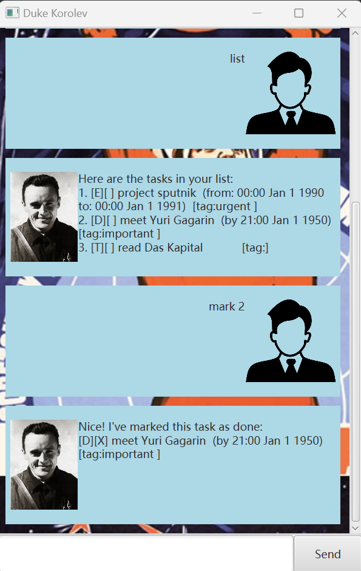

# Joseph User Guide



Joseph helps you keep track of stuff, allowing you to:
- Add and delete tasks
- Mark and unmark tasks
- Work with tasks of varying details (ToDos, Deadlines, Events)

## Simple Commands

*help*: Shows you a list of all available commands

*list*: Shows you the current list

*bye*: Closes the chatbot

## Adding ToDos

A ToDo is a simple task without any other details.


Example: `todo lunch`

```
I've added the todo: lunch
```

## Adding Deadlines

A deadline is a task with a due date and time

Example: `deadline homework /19/07/2024 1300`

```
I've added the deadline: homework due: Jul 19 2024, 1:00 pm
```

## Adding Events

An event is a task with a start timing and an end timing

Example: `event lecture /20/07/2024 1500 /20/07/2024 1700`

```
I've added the event: lecture start: Jul 20 2024, 3:00 pm end: Jul 20 2024, 5:00 pm
```

## Deleting tasks

Example: `delete 1`

```
Alright, I've deleted lunch
```

## Marking/Unmarking tasks

Example: `(un)mark 1`


```
Great, I've marked lunch as done!
Okay, I've unmarked lunch as not done!
```