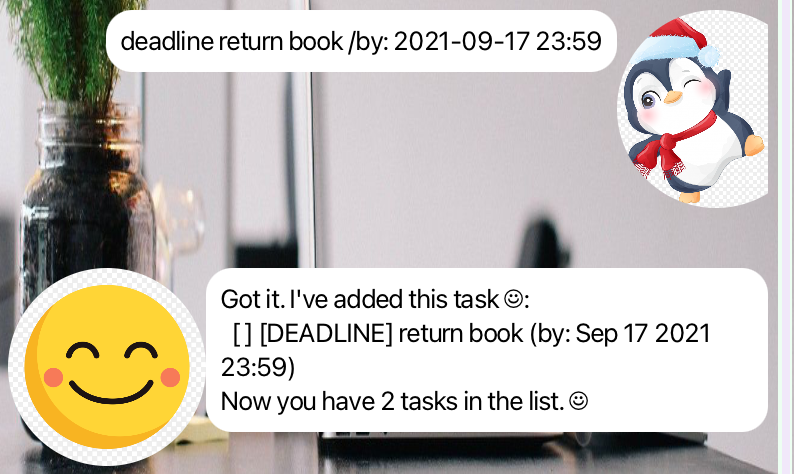
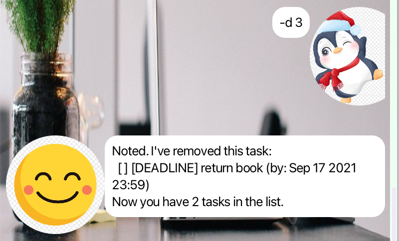

# _Ollie_ User Guide


> _Organize with ease, accomplish with **Ollie ☺** !_ ️

# What is Ollie️ ☺️
**Ollie ☺**️ is your task manager app! 
- Manages your tasks for you
- _User-friendly_ syntax using one-letter commands
- [Features](#features)
  - [Adding tasks](#add-a-task)
  - [Listing tasks](#list-all-tasks)
  - [Deleting tasks](#delete-a-task)
  - [Marking tasks](#mark-a-task-as-done)
  - [Finding tasks](#find-tasks)

# How to use Ollie️ ☺️
1. Download the latest release [here](https://github.com/rxchell/ip/releases) 👈🏼
2. Go to the folder with `ollie.jar`
3. Run this command in the folder to open the application.
    ```bash
    java -jar ollie.jar
    ```
4. The Ollie ☺ application starts! 🎉


# Features
Function | Command | Format                                                    | Example
--- |---|-----------------------------------------------------------| ---
[Add a Todo task](#add-a-todo-task) | `todo` | `todo <description>`                                      | `todo read book`
[Add a Deadline task](#add-a-deadline-task) | `deadline` | `deadline <description> /by: <YYYY-MM-DD HH:MM>`                      | `deadline return book /by: 2021-09-30 18:00`
[Add an Event task](#add-a-deadline-task) | `event` | `event <description> /from: <YYYY-MM-DD HH:MM> /to: <YYYY-MM-DD HH:MM>` | `event meeting /from 2021-09-17 14:00 /to 2021-09-17 16:00`
[List all tasks](#list-all-tasks) | `-l` | `-l`                                                      | `-l`
[Mark a task as done](#mark-a-task-as-done) | `-m`| `-m <task number>`                                        | `-m 1`
[Mark a task as undone](#mark-a-task-as-undone) | `-u`| `-u <task number>`                                        | `-u 1`
[Delete a task](#delete-a-task) | `-d` | `-d <task number>`                                        | `-d 1`
[Find a task with the keyword](#find-tasks) | `-f` | `-f <keyword to find>`                                    | `-f book`

Other commands:
- `-b`: Say bye to Ollie ☺

## Add a task
There are 3 types of tasks that can be added to the task list:
1. **Todo**: Has no date or time 
2. **Deadline**: Has a deadline for the task to be completed by
3. **Event**: Has start and end times for the task

### Add a Todo task
> ```
> todo <description>
> ``` 
> Adds a todo task with a description. 

Example: `todo read book` adds a Todo task to the task list.


### Add a Deadline task
> ```
> deadline <description> /by: <YYYY-MM-DD HH:MM>
> ```
> Adds a deadline task with a description and date.
> 
> The date should be in the format **YYYY-MM-DD HH:MM**, eg `2021-09-17 23:59`.

Example: `deadline return book /by: 2021-09-17 23:59` adds a Deadline task to the task list.



### Add an Event task
> ```
> event <description> /from: <YYYY-MM-DD HH:MM> /to: <YYYY-MM-DD HH:MM>
> ```
> Adds an event task with a description, start time and end time.
> 
> The start and end times should be in the format **YYYY-MM-DD HH:MM**, eg `2021-09-17 14:00`.

Example: `event meeting /from: 2021-09-17 14:00 /to: 2021-09-17 16:00` adds an Event task to the task list.


## List all tasks
> ```
> -l
> ```
> Lists all tasks in the task list.

Example: `-l` lists all tasks in the task list.


## Update a task
### Mark a task as done
> ```
> -m <task number>
> ```
> Marks a task as done, using the task number specified in the task list.

Example: `-m 1` marks the first task in the list as done.


### Mark a task as undone
> ```
> -u <task number>
> ```
> Marks a task as undone, using the task number specified in the task list.

Example: `-u 1` marks the first task in the list as undone.


### Delete a task
> ```
> -d <task number>
> ```
> Deletes a task, using the task number specified in the task list.

Example: `-d 3` deletes the third task in the list.



## Find tasks
> ```
> -f <keyword to find>
> ```
> Finds tasks with the keyword in the description.

Example: `-f book` finds tasks with the keyword `book` in the description.


