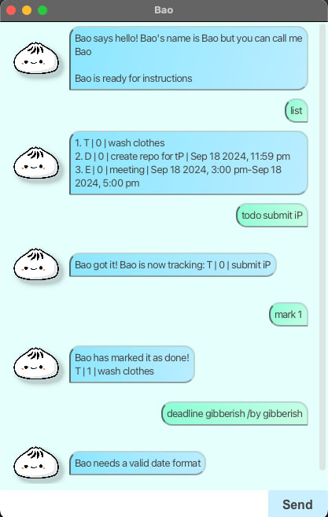

# Broski User Guide



Your one and only trusty gymbro bot who will help you keep track of all your tasks! 💪

## Add tasks

There are 3 different types of tasks you can make use of:

### Todo

Add Todo tasks to your list of tasks.

Example: `todo math homework`

The bot will then inform you that it has been added to the list.

```
Gotcha! I've added this task:
  [T][] math homework
Now you have 1 tasks in the list.
```

### Deadline

Add Deadline tasks to your list of tasks.

Example: `deadline sci homework /30/09/2024 1700`

The bot will then inform you that it has been added to the list.

```
Gotcha! I've added this task:
  [D][] sci homework (by Sep 30 2024, 05:00pm)
Now you have 2 tasks in the list.
```

### Event

Add Event tasks to your list of tasks.

Example: `event summer festival /01/06/2025 0600 /01/07/2025 0600`

The bot will then inform you that it has been added to the list.

```
Gotcha! I've added this task:
  [E][] summer festival (from Jun 01 2025, 
06:00am to Jul 01 2025, 06:00am)
Now you have 3 tasks in the list.
```

## Mark as Done

Mark tasks as done. If you want the n-th item in list to be marked as done, send command as "mark n-1".

Example: `mark 0`

The bot will then mark 1st task as done. Works for all integers.

```
Solid! Marked as done for you:
[T][X] math homework
```

## Mark as Undone

Mark tasks as undone. If you want the n-th item in list to be marked as undone, send command as "unmark n-1".

Example: `unmark 0`

The bot will then mark 1st task as undone. Works for all integers.

```
Alright, I've marked the task as undone:
[T][] math homework
```

## Delete task

Delete tasks from your list. If you want the n-th item in list to be deleted, send command as "delete n-1".

Example: `delete 2`

The bot will then delete 3rd task. Works for all integers.

```
Gotcha, I've removed this task:
[E][] summer festival (from Jun 01 2025, 06:00am
to Jul 01 2025, 06:00am)
Now you have 2 tasks in the list.
```

## List tasks

Displays the entire list of tasks.

Example: `list`

The bot will then display your full list including description, deadline (if applicable) and duration (if applicable).

```
1. [T][] math homework
2. [D][] sci homework (by Sep 30 2024, 05:00pm)
```

## Find tasks

Finds a task that corresponds to a particular keyword.

Example: `find math`

The bot will then list the tasks that have the keyword in its description.

```
Here are the matching tasks in your list bro:
1. [T][] math homework
```

## Archive tasks

Removes task from the main list of tasks and adds the task to an archive list. If you want the n-th item in list to be archived, send command as "archive n-1".

Example: `archive 1`

The bot will then archive the 2nd task. Works for all integers.

```
Your task has been archive bro:
[D][] sci homework (by Sep 30 2024, 05:00pm)
```

## List archive

Displays the entire archive list of tasks.

Example: `archivelist`

The bot will then display your full archive list including description, deadline (if applicable) and duration (if applicable).

```
1. [D][] sci homework (by Sep 30 2024, 05:00pm)
```

## Leave

Bot wishes you goodbye allowing you to have a pleasant farewell.

Example: `archivelist`

The bot will then wish you goodbye, and you can exit the bot using the x button at the top of the window.

```
Bye, bro. See ya around!
```