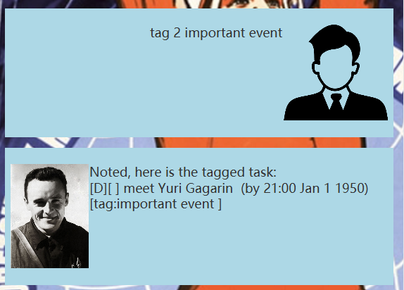

# Duke Korolev User Guide

  
## Product Introduction
> You can do it quickly, but badly, or you can do it slowly, but well. After a while, everyone will forget that it was fast, but will remember that it was bad. And vice versa.  - Sergei Korolev (<a href="https://en.wikiquote.org/wiki/Sergei_Korolev">source</a>)

DukeKorolev is a ~~robot~~ **chatbot** that help you manage tasks in the daily lives.
The software is named after the famous Soviet engineer *Sergei Korolev*. The bot is

- text-based
- user friendly
- extremely fast
- free to use 👍

You can create, view and delete tasks with three different types - todo, event and deadline. You can also better 
manage your task lists by tagging tasks and changing status of completion of tasks. Furthermore, you
can display the statistics of current 

## Quick start
1. Ensure you have `java 17` or above installed in your PC.
2. Download the latest `.jar` file from <a href="https://github.com/CYX22222003/ip/releases/download/A-FinalRelease/korolev.DukeKorolev.jar">here</a>
3. Copy the file to the folder you want to use as the home folder for your DukeKorolev
4. Open command terminal, `cd` into the selected folder with jar file
5. run command `java -jar korolev.DukeKorolev.jar`. A GUI similar to the image above will be shown in the screen

## Features
### Display the list of tasks
Display all tasks that has been added to the list.
   
Format of input: `list`   
Example: `list`  

### Add deadline task
Add a type of deadline task (a task with 1 deadline) to the task list.
Format of input: `deadline [task description] /by [end time with format YYYY-MM-DD (HH:mm)]`  
* the keyword `deadline` is case-sensitive
* there is a space between `deadline` and task description
* It must contain a date to following `/by`
* The time is optional. The default time is `00:00`
* Don't use reserved word "/by", "/from", "[X]", "to" in the documents.

Example: `deadline meet with Gagarin /by 1970-01-01 12:00`  

### Add todo task
Add a type of todo task (a task without any time) to the task list.   
Format of input: `todo [task description]`  
* the keyword `todo` is case-sensitive
* there is a space between `todo` and task description
* anything appears after `todo` will be used as task description  
* Don't use reserved word "/by", "/from", "[X]", "to" in the documents.

Example: `todo read aerodynamics documents`   

   
   
### Add event task
Add a type of event task (a task with start and end time) to the task list.  
Format of input: `event [task description] /from [start time with format YYYY-MM-DD (HH:mm)] 
/to [end time with format YYYY-MM-DD (HH:mm)]`  
* the keyword `event` is case-sensitive
* It must contain a start date and time with `/from` keyword and an end date and time with `/to` 
keyword 
* The time must include the year, month and date of the event. 
* It is optional to key in the specific time, the default time will be `00:00`
* Don't use reserved word "/by", "/from", "[X]", "to" in the documents.

Example: `event launch Sputnik satellite /from 1960-01-01 /to 1961-02-03`  
  

### Mark a task as done
Mark an incomplete task in the task list as done.
Format of input: `mark [task ID]`  
* `mark` is case-sensitive
* an out-of-bound error message will be prompted if the task ID is out of range
* an error will be prompted from the chatbot if the task ID is not a number 

Example: `mark 1`  

### Unmark a completed task
Unmark a finished task as undone.  
Format of input: `unmark [task ID]`  
* `unmark` is case-sensitive
* an out-of-bound error message will be prompted if the task ID is out of range
* an error will be prompted from the chatbot if the task ID is not a number

Example: `unmark 1`  

### Add tag to a task 
Add a tag to any task.   
Format of input: `tag [task ID] [task description]`
* `tag` is case-sensitive
* each task can have at most one tag
* an out-of-bound error message will be prompted if the task ID is out of range
* an error will be prompted from the chatbot if the task ID is not a number
* an empty task description will do noting to the task  

Example:  `tag 2 important event`  

### Untag a task
Remove a tag from the task
Format of input: `untag [task ID]`  
* `untag` is case-sensitive
* an out-of-bound error message will be prompted if the task ID is out of range
* an error will be prompted from the chatbot if the task ID is not a number

Example: `untag 2`   

### Find a list of tasks by name
Search for a list of tasks which contains the keyword.  
Format of input: `find [keyword]`  
* `find` is case-sensitive
* the keyword is case-sensitive
* it will find matching word in the task description

Example: `find aerodynamics`   

### Delete a task
Delete a task from the list of tasks.  
Format of input: `delete [task ID]`  
* `delete` is case-sensitive
* an out-of-bound error message will be prompted if the task ID is out of range
* an error will be prompted from the chatbot if the task ID is not a number

Example: `delete 3`  

### Display statistics of the task list
Display the number of complete and incomplete tasks.  
Format of input: `stats`   
* `stats` is case-sensitive

Example: `stats`  

### Exit the program
Key in bye to close the chatbot and save data to local disk
Format of input `bye`
* There should not be any space before and after `bye`

## Command summary

| Command                   | Format                                                                                                                     | Example                                                          |
|---------------------------|----------------------------------------------------------------------------------------------------------------------------|------------------------------------------------------------------|
| Display the list of tasks | `list`                                                                                                                     | `list`                                                           |
| Add deadline task         | `deadline [task description] /by [end time with format YYYY-MM-DD (HH:mm)]`                                                | `deadline meet with Gagarin /by 1970-01-01 12:00`                |
| Add todo task             | `todo [task description]`                                                                                                  | `todo read aerodynamics documents`                               |
| Add event task            | `event [task description] /from [start time with format YYYY-MM-DD (HH:mm)] /to [end time with format YYYY-MM-DD (HH:mm)]` | `event launch Sputnik satellite /from 1960-01-01 /to 1961-02-03` |
| Delete a task             | `delete [task ID]`                                                                                                         | `delete 3`                                                       |
| Tag a task                | `tag [task ID] [task description]`                                                                                         | `tag 2 important event`                                          |
| Untag a task              | `untag [task ID]`                                                                                                          | `untag 2`                                                        |
| Mark a task as done       | `mark [task ID]`                                                                                                           | `mark 4`                                                         |
| Unmark a completed task   | `unmark [task ID]`                                                                                                         | `unmark 4`                                                       |
| Find a task               | `find [keyword]`                                                                                                           | `find aerodynamics`                                              |
| Display statistics        | `stats`                                                                                                                    | `stats`                                                          |
| Exit the program          | `bye`                                                                                                                      | `bye`                                                            |