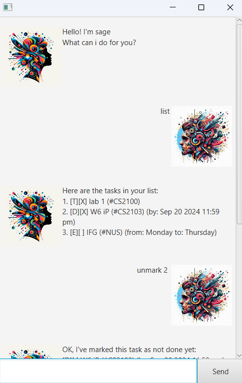

# CancelGPT User Guide

# Keep track of tasks, deadlines, events, and fixed duration tasks!
Introducing **CancelGPT**!

CancelGPT is a GUI application that helps you manage various tasks.

# Starting the application

Ensure you have Java 17 or above installed in your Computer.

Download the latest .jar file from the release.

Copy the file to the folder you want to use as the home folder for your CancelGPT application.

Open a command terminal, cd into the folder you put the jar file in, and use the java -jar CancelGPT.jar command to run the application.

# Features

It offers a number of functionalities that can be called using the following commands below.

| Command     | Syntax                                                              | Description                                                    | Example                                                   |
|-------------|---------------------------------------------------------------------|----------------------------------------------------------------|-----------------------------------------------------------|
| list        | **list**                                                            | Displays the list of tasks that you have, with the task number | `list`                                                    
| mark/unmark | **mark/unmark {task number}**                                       | Marks or unmarks that task as done.                            | `mark 5, unmark 2`                                        |
| todo        | **todo {task name}**                                                | Adds a todo task into your task list.                          | `todo Buy groceries`                                      |
| deadline    | **deadline {task name} /by {YYYY-MM-DD HHmm}**                      | Adds a task with a deadline to your task list.                 | `deadline Finish report /by 2024-12-31 0800`              |
| event       | **event {task name} /from {YYYY-MM-DD HHmm} /to {YYYY-MM-DD HHmm}** | Adds an event with a start/end date times to your task list.   | `event Meeting /from 2024-12-31 1000 /to 2025-01-02 1130` |
| fixed       | **fixed {task name} /for {hours}**                                  | Adds a task with a fixed duration to your task list.           | `fixed Workout /for 2.5`                                  |
| delete      | **delete {task number}**                                            | Deletes the task with that number from your task list.         | `delete 3`                                                |
| find        | **find {keyword}**                                                  | Finds all tasks containing that keyword from your task list.   | `find report`                                             |
| bye         | **bye**                                                             | Exits the application.                                         | `bye`                                                     |