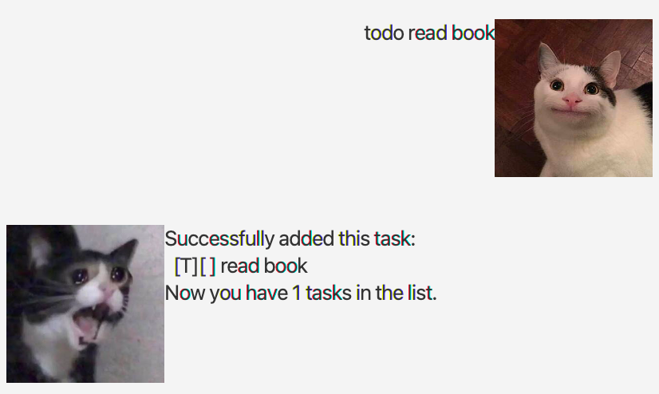
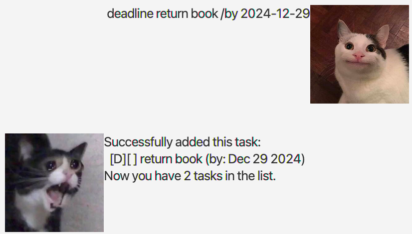
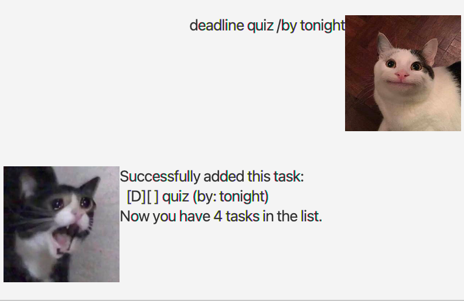
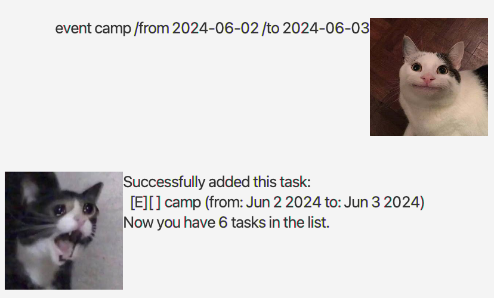
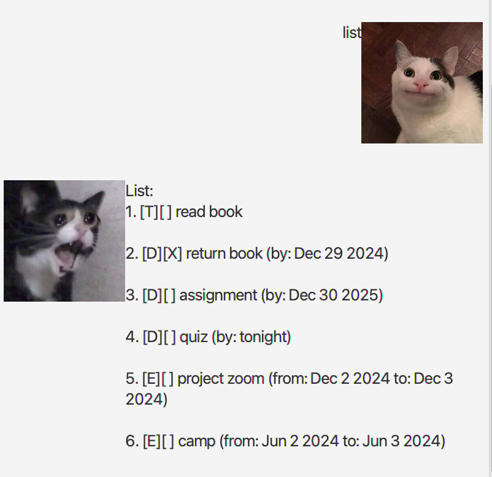
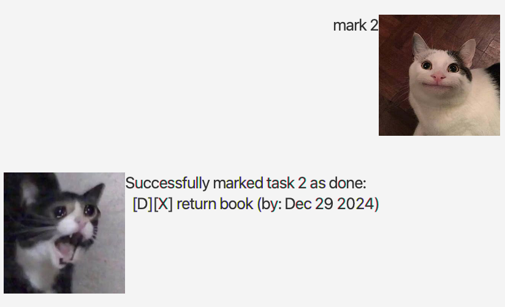
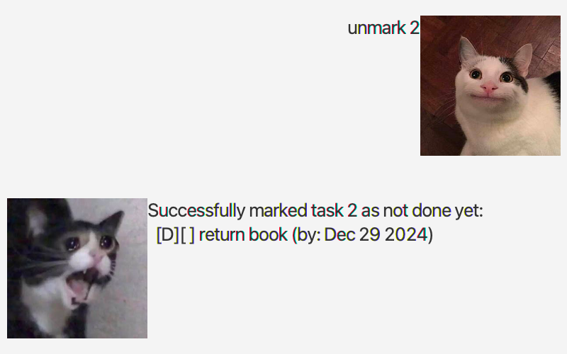
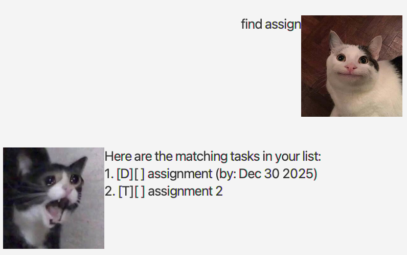

# TrackBot User Guide


**TrackBot is a desktop application for managing your everyday tasks.**

By combining Command Line Interface (CLI) and Graphical User Interface (GUI),
it allows everyone to manage their tasks faster than traditional GUI apps.
Our GUI allows users to view their interactions with TrackBot.

## Features

### Adding a task

#### 1. Adding a todo task : ```todo```

Adds a todo task to the task list.

Format: ```todo <task description>```

Example: ```todo read book```

Expected output:
<br>


#### 2. Adding a task with deadline : ```deadline```

Adds a task with a deadline to the task list.

Format: ```deadline <task description> /by <date/time>```
- The input date can be in the format of "yyyy-MM-dd", "MM-dd-yyyy", "dd-MM-yyyy", "dd-MMM-yyyy" and it will then be 
formatted to "MMM d yyyy", or,
- "yyyy-MM-dd HH:mm" and it will be formatted to "MMM d yyyy HH:mm", or,
- any format but it will not be formatted to any date or time.

Examples: 
- ```deadline return book /by 2024-12-29```
- ```deadline assignment /by 30-Dec-2025```
- ```deadline return books /by 2026-11-29 20:20```
- ```deadline quiz /by tonight```

Expected output:
<br>

<br>


#### 3. Adding an event with starting date/time and ending date/time : ```event```

Adds an event with a starting date/time and ending date/time to the task list.

Format: ```event <description> /from <start> /to <end>```
- The start and end can be in the format of "yyyy-MM-dd", "MM-dd-yyyy", "dd-MM-yyyy", "dd-MMM-yyyy" and it will 
then be formatted to "MMM d yyyy", or,
- "yyyy-MM-dd HH:mm" and it will be formatted to "MMM d yyyy HH:mm", or,
- any format but it will not be formatted to any date or time.

Examples:
- ```event camp /from 2024-06-02 /to 2024-06-03```
- ```event project zoom /from 2024-12-02 12:12 /to 2024-12-03 13:30```

Expected output:
<br>

<br>

### Listing all tasks : ```list```

Shows a list of all tasks in the task list.

Format: ```list```
- Do not type anything before or after the ```list``` command as TrackBot will not understand that command.

Expected output:
<br>


### Deleting a task : ```delete```

Deletes a task with a specified task number from the task list.

Format: ```delete <task number>```
- Entering an invalid task number will produce the following output
```Please enter a valid task number.```
- Examples of invalid task numbers are negative integers and ```delete 100```
when there is only 3 tasks in the task list.

Examples:
- ```delete 1```
- ```delete 3```

Expected output:
<br>

### Marking a task : ```mark```

Marks a task with a specified task number in the task list.

Format: ```mark <task number>```
- Entering an invalid task number will produce the following output
  ```Please enter a valid task number.```
- Examples of invalid task numbers are negative integers and ```mark 100```
  when there is only 3 tasks in the task list.

Examples:
- ```mark 1```
- ```mark 2```


Expected output:
<br>



### Unmarking a task : ```unmark```

Unmarks a task with a specified task number in the task list.

Format: ```unmark <task number>```
- Entering an invalid task number will produce the following output
  ```Please enter a valid task number.```
- Examples of invalid task numbers are negative integers and ```unmark 100```
  when there is only 3 tasks in the task list.

Examples:
- ```unmark 1```
- ```unmark 2```

Expected output:
<br>


### Finding a task : ```find```

Find a task with a specified description in the task list.

Format: ```find <task keyword>```
- The search is case-insensitive. e.g Quiz will match quiz
  The order of the keywords does not matter. e.g. Hans Bo will match Bo Hans
  Only the name is searched.
  Only full words will be matched e.g. Han will not match Hans
  Persons matching at least one keyword will be returned (i.e. OR search). e.g. Hans Bo will return Hans Gruber, Bo Yang

Examples:
- ```find read book```
- ```find zoom```

Expected output:
<br>


### Exit Command : ```bye```

TrackBot will reply ```"Bye. Hope to see you again soon!"```.

<br>
<br>
<br>


