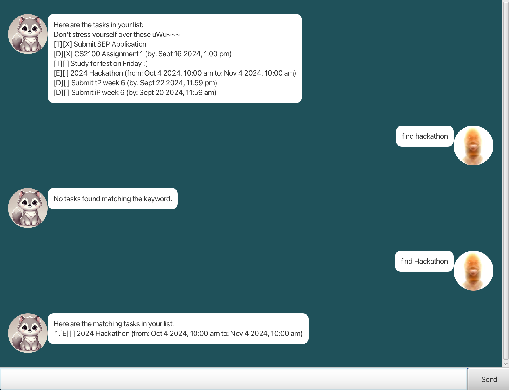

# Wolfie User Guide 🐺 🚀
**Wolfie** is a **task management chatbot** for managing tasks, optimized for use via a Command Line Interface (CLI)


### We at Wolfie.inc aim to save your time! Our app is designed to be:
- **Fast** to use ⚡
- **Easy** to learn 💯
- **Convenient** to use 👌
- **Reliable** to store your data ✅
---
## Quick Start
1. Ensure you have Java `17` or above installed in your Computer.
2. Download the latest `wolfie.jar` from [here](https://github.com/jonushzw/ip/releases).
3. Copy the file to the folder you want to use as the home folder for your Wolfie.
4. Open a command terminal, navigate to the folder where `wolfie.jar` is located. and use the command
`java -jar wolfie.jar` to start the app.
---
## Features

### Notes about the command format:

> All commands are in lowercase.

> Date format is `yyyy-mm-dd HH:mm` unless specified otherwise.

### Adding a task: 
* `todo` 
    - Adds a todo task to the task list. 
    - Format: `todo <description>`
* `deadline`
    - Adds a deadline task to the task list.
    - Format: `deadline <description> /by <date>`
* `event`
    - Adds an event task to the task list.
    - Format: `event <description> /at <date>`

### Listing of tasks: 
* `list` 
    - Lists all tasks in the task list.
    - Format: `list`
* `find`
    - Finds tasks that contain the keyword (**case-sensitive**).
    - Format: `find <keyword>`
* `on`
    - Lists all tasks on the specified date.
    - Format: `on <date>` without time (e.g. `2021-10-01`)

### Marking tasks as done:
* `done`
    - Marks the task at the specified index as done.
    - Format: `done <index>`
* `undone`
    - Marks the task at the specified index as undone.
    - Format: `undone <index>`

### Deleting tasks:
* `delete`
    - Deletes the task at the specified index.
    - Format: `delete <index>`

### Exiting the program:
* `bye`
    - Exits the program.
    - Format: `bye`
---
### Example Usage: 
* `find Hackathon` returns all tasks that contain the word **Hackathon**.


```
Here are the matching tasks in your list:
1.[E}[] 2024 Hackathon (from: Oct 4 2024, 10:00 am to Nov 4 2024, 10:00 am)
```