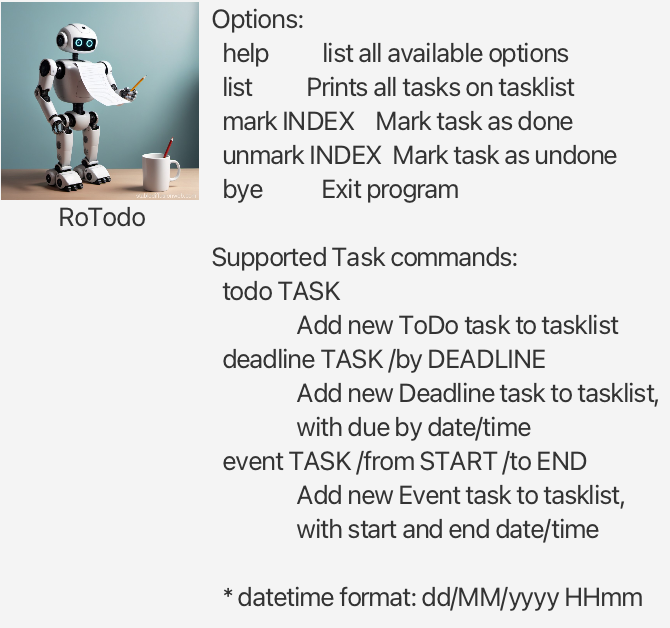

# Hoshi - Your Task Assistant (User Guide)

Hoshi is a user-friendly assistant that aids you in keeping track of your tasks so you will remain on top of things!

## Features

1. Add ToDos/Deadlines/Events
2. Mark/Unmark Tasks as Complete/Incomplete
3. Delete Tasks
4. Find Tasks
5. Graphical User Interface
6. Help Window

## Setting up in Intellij (For Quick Start, skip to Running JAR File)

Prerequisites: JDK 17, update Intellij to the most recent version.

1. Open Intellij (if you are not in the welcome screen, click `File` > `Close Project` to close the existing project first)
2. Open the project into Intellij as follows:
   - Click `Open`.
   - Select the project directory, and click `OK`.
   - If there are any further prompts, accept the defaults.
3. Configure the project to use **JDK 17** (not other versions) as explained in [here](https://www.jetbrains.com/help/idea/sdk.html#set-up-jdk). 
   In the same dialog, set the **Project language level** field to the `SDK default` option.
4. Ensure Gradle is installed
5. After that, run gradle either by CLI `gradle run` or inbuilt Gradle GUI in IntelliJ. Running `gradle build` is optional but recommended

## Running JAR File (Quick Start)

1. Ensure JDK-17.0.12 or equivalent is installed locally
2. Download the latest JAR file [here](https://github.com/ITLimJiaWei/ip/releases)
3. Open a command terminal `cd` into folder the jar file was placed in and use `java -jar hoshi.jar` command to run the application

A GUI similar to the below should appear

4. Type a command in the text input at the bottom and press Enter to execute it.
5. There is a help button located at the top right for more information on available commands.

## Features

Below is a summary of commands and corresponding examples to utilize Hoshi.

1. Add todo/deadline/event - `Add deadline CS2103 2022-12-01`
2. Mark/Unmark - `Mark 1`
3. Delete - `Delete 1`
4. Find - `Find ASG`
5. List - `List`
6. Bye - `Bye`

More detailed breakdowns are included below.

### Adding a task: `add`

Adds a todo, deadline or event to Hoshi.

Format: `add TASKTYPE DESCRIPTION STARTDATE ENDDATE`

Examples:
- `add todo ASG1` 
- Adds a todo task with description "ASG1"
- `add deadline ASG1 2022-12-12`
- Adds a deadline task with description "ASG1" with end date "2022-12-12"
- `add event ASG1 2022-12-12 2022-12-22`
- Adds an event task with description "ASG1" with "2022-12-12", "2022-12-22" being start and end dates respectively

Note that dates must be in YYYY-MM-DD format

### Marking/Unmarking a task: `mark`/`unmark`

Marks or unmarks an added task where `TASKNUMBER` is the number of task displayed in `list`.

Format: `mark TASKNUMBER`
Format: `unmark TASKNUMBER`

Examples:
- `mark 1`
- `mark 2`

### Deleting a task: `delete`

Deletes a task where `TASKNUMBER` is the number of task displayed in `list`.

Format: `delete TASKNUMBER`

Examples:
- `delete 1`
- `delete 2`

### Locating task by description: `find`

Finds a task which contains the given keyword in its description.

Format: `find KEYWORD`

- The search is not case-sensitive e.g. `ASG` will still match `asg`.
- Although `find d s` input is accepted, Hoshi will only consider d as a keyword.
- Partial words will be matched e.g. `AS` will still match `ASG`

Examples:
- `find ASG`
- `find CS2103`

### Listing all tasks: `list`

Displays a list of all tasks in Hoshi.

Format: `list`

### Viewing help: `help` button

Click on the `help` button at the top right of the GUI to view a summary of available commands.

### Exiting the program: `bye`

Exits the program after 2 seconds.

Format: `bye`

### Saving the data

Hoshi data is saved automatically after any command that changes the data. There is no need to manually save.

## Acknowledgements

1. ASCII Art - [Link](https://patorjk.com/software/taag/#p=testall&f=Star%20Wars&t=HOSHI)
2. JavaFX initOwner Method - [Link](https://docs.oracle.com/javase/8/javafx/api/javafx/stage/Stage.html)
3. JavaFX PauseTransition Method - [Link](https://stackoverflow.com/questions/30543619/how-to-use-pausetransition-method-in-javafx)
4. Arrays copyOfRange Method - [Link](https://www.geeksforgeeks.org/java-util-arrays-copyofrange-java/)