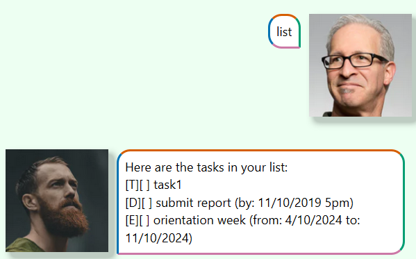

# ChattyBuddy User Guide


ChattyBuddy is a personal task management and productivity assistant built using Java and JavaFX. It allows users to manage tasks such as todos, deadlines, and events via a simple chat-like interface. ChattyBuddy helps you organize your tasks and keeps track of your progress, whether it's marking tasks as done, undoing actions, or retrieving previously saved tasks.

## Usage Examples

There are several command keywords: `todo`, `deadline`, `event`, `mark`, `unmark`, `list`, `delete` and `undo` and `bye`.

For `todo`: follow the format of `todo (description)`
E.g.
```
todo finish CS1101S homework
```
It will store a todo item with the description

Expected output:
```
Got it. I've added this task: [T][ ] finish CS1101S homework. Now you have 1 tasks in the list
```

However, if no description is provided, an EmptyTaskException will be thrown:
```
OOPS!! The description of a todo cannot be empty
Have you forgotten to enter the details?
```

## Display list of tasks

After entering different tasks such as todos and deadlines, they will be saved to the
local storage. The users could retrieve by entering `list`

E.g. 


## Mark tasks

The users could mark a certain task as done/not done

E.g.


## Delete tasks

The users could delete a certain task by entering the index of the task

E.g.


## Undo command

The users could undo their previous command (except for list and bye)

E.g.


## Exit the application

To exit the application, user just need to enter `bye` and after 3 seconds the application will automatically end.