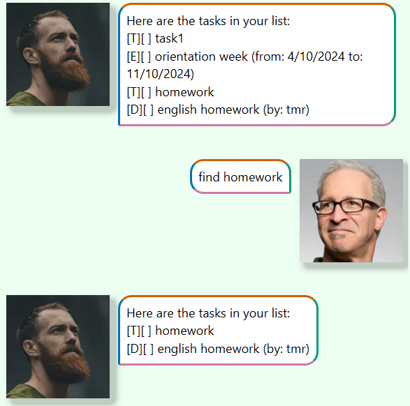
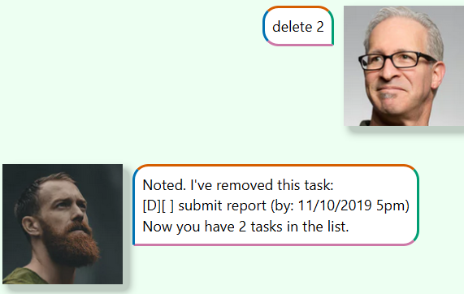
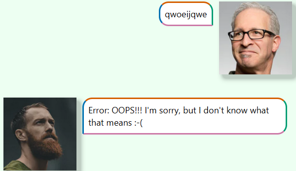

# Topaz User Guide

## Features

*Words in `UPPER_CASE` are the parameters to be supplied by the user.
eg. in `todo TASK`, `TASK` is a parameter which can be used as `todo return book`.
*

---
## Adding tasks
Adds a new task to the task list.
There are three type of task:
- **Todo**: Tasks without any date/time attached to it e.g., *visit new theme park*
- **Deadlines**: Tasks that need to be done before a specific date/time e.g., *submit report by 11/10/2019 5pm*
- **Events**: Tasks that start at a specific date/time and ends at a specific date/time
  e.g., (a) *team project meeting 2/10/2019 2-4pm* (b) *orientation week 4/10/2019 to 11/10/2019*

### Adding a todo task: `todo`

Adds a todo task to the list.

**Format**: `todo DESCRIPTION` **`todo` should be in all lowercase**

**Example**: `todo borrow book`

**Expected output**:

### Adding a deadline task: `deadline`
Adds a deadline task to the list.

**Format**: `deadline DESCRIPTION /by YYYY-MM-DD HH:MM`

**Example**: `deadline return book /by 2024-09-19 13:00`

**Expected output**:

**Error Handling**:
- Input of incorrect datetime or bad command format will cause a warning.

- Examples:
  `deadline submit assignmeny /by 2024-9-19 13:00` *The month format lacks a 0*
  
  `deadline assignment by 2024-09-19 13:00` *Miss slash before `by`*
  
  `deadlinesubmit assignment /by 2024-09-19 13:00` *Miss whitespace after `deadline`*

- Response (same for all examples):
  
  

### Adding a event task: `event`
Adds an event task to the task list.

**Format**: `event DESCRIPTION /from YYYY-MM-DD HH:MM /to YYYY-MM-DD HH:MM`

**Example**: `event project meeting /from 2024-09-19 08:00 /to 2024-09-19 10:00`

**Expected output**:

**Error Handling**:
- Input of incorrect datetime or bad start and end format will cause a warning.
  
- Examples:
  `event project meeting /from 2024-9-19 08:00 /to 2024-09-19 10:00` *The month format lacks a 0*

  `event project meeting from 2024-09-19 08:00 /to 2024-09-19 10:00` *Miss slash before `from`*

  `eventproject meeting /from 2024-09-19 08:00 /to 2024-09-19 10:00` *Miss whitespace after `event`*

- Response (same for both example):

  

---
## Listing all tasks: `list`
Shows a list of all tasks in the chatbot tasklist

**Format**: `list` *Notice that command should exactly as same as "list".*

**Expected output**:

---
## Marking task as done: `mark`
Marks the designated task as done.

**Format**: `mark INDEX`

**Examples**: 
- `mark 1`

**Expected output**:

**Error handling**:
- Input incorrect command format
   
  Example: `mark1`
  
  Output:

  

- Input index is out of range of the task list
  
  Example: `mark 100` (current task list has less than 100 tasks)

  Output:

  

---
## Marking task as undone: `unmark`
Marks the designated task as undone.

**Format**: `unmark INDEX`

**Examples**:
- `unmark 1`

**Expected output**:

  

**Error handling**:
- Input incorrect command format

  Example: `unmark1`

  Output:

  

- Input index is out of range of the task list

  Example: `unmark 100`(current task list has less than 100 tasks)

  Output:

  
  

---
## Deleting task: `delete`
Deletes the task of designated index.

**Format**: `delete INDEX`

**Example**: `delete 1`

**Output**: 

**Error handling**:
- Input incorrect command format

  Example: `delete1`

  Output:
 
  

- Input index is out of range of the task list

  Example: `delete 100`(current task list has less than 100 tasks)

  Output:

  
---

## Viewing help: `help`
Shows how to use the chatbot and different commands.

**Format**: `help` *Notice that command should exactly as same as "help".*

**Expected output**:

---

## Showing weekly statistic: `statistic`
Shows the number of tasks completed this week (Monday 00:00 - Sunday 23:59 of current day).

**Format**: `statistic`

**Expected output**:
- If there's no task in current task list:

  
  
- If there's no task finished this week:

  

- If there's 1 or more tasks finished this week:
  
 

