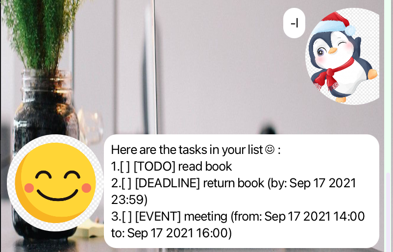

# GreetBot User Guide


## Introduction


GreetBot is a task manager that can keep track of all your tasks.

## Features

Available Features:
1. Display the entire list of tasks
2. Mark the task as done
3. Unmark the task as not done
4. Add a todo task
5. Add a event task
6. Add a deadline task
7. Delete a task in the tasklist
8. Find a task in the tasklist
9. Exit the bot

### List Tasks

Shows a list of all tasks in the task list.

Format: `list` or `l`

Sample outcome: 



### Mark Tasks

Marks a task as completed. If the task is already completed, then there is no effect.

Format: `mark <task number>` or `m <task number>`

Constrain: `<task number>` should be a positive number which is less than the current length of the tasklist.

Sample commands: 

```
mark 1
```

```
m 1
```

Sample outcome:


### Unmark Tasks

Unmarks a task as not completed. If the task is already not completed, then there is no effect.

Format: `unmark <task number>` or `um <task number>`

Constrain: `<task number>` should be a positive number which is less than the current length of the tasklist.

Sample commands:

```
unmark 1
```

```
um 1
```

Sample outcome:


### Add todo task

Add a todo task to the tasklist

Format: `todo <task description>` or `t <task description>`

Sample outcome:


### Add event task

Add a event task to the tasklist

Format: `event <task description> \from <string> \to <string>` or `e <task description> \from <string> \to <string>` 

`<string>` is to describe from and to information

Sample outcome:


### Add deadline task

Add a deadline task to the tasklist

Format: `deadline <task description> \by <time string>` or `d <task description> \by <time string>` 

Constrain: `<time string>` must be in the form of `yyyy-mm-dd` if not, 
the bot will inform you that the format is not correct

Sample outcome:


### Delete a task

Delete a task from the tasklist

Format: `delete <task number>` or `del <task number>`

Constrain: `<task number>` should be a positive number which is less than the current length of the tasklist.

Sample outcome:


### Find a task

Find all tasks that their description contains the string for matching.  

Format: `Find <string for matching>`

Sample outcome:


### Exit the bot

Format: `bye`

Sample outcome:


## How to use GreetBot on your local laptop
- Download the `.jar` file under `Releases`,
- Navigate to the directory in terminal,
- run `java -jar greetbot.jar`