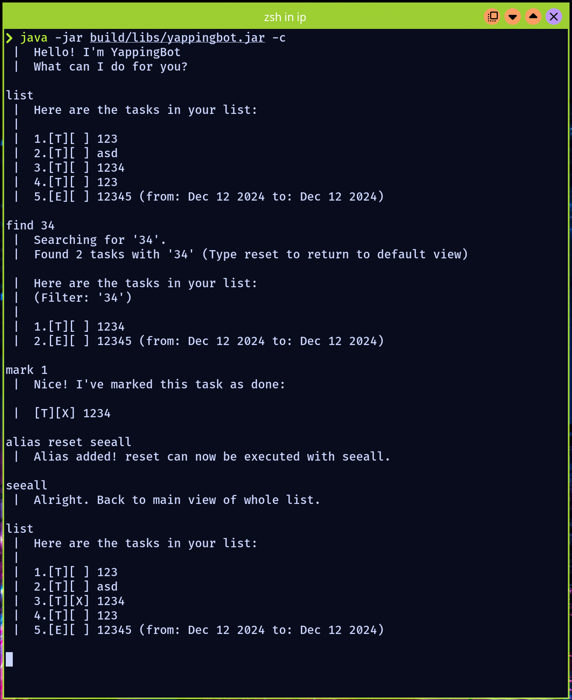

# Makima User Guide

The following user guide is written for Window users. The application may or may not work
with other operating systems. Makima is a desktop app for managing generic tasks.
Makima implements the following type of tasks:

1. ToDo: a named task
2. Deadline: a named task with an end date
3. Event: a named task with a start and end date

- [Quick start](#quick-start)
- [Command Help](#command-help)
    - [todo](#todo)
    - [deadline](#deadline)
    - [event](#event)
    - [delete](#delete)
    - [mark](#mark)
    - [unmark](#unmark)
    - [list](#list)
    - [find](#find)
    - [prioritise](#prioritise)
    - [return](#return)
    - [bye](#bye)
- [Common problems](#common-problems)
- [Command summary](#command-summary)
- [Credits](#credits)


## Quick Start

1. Ensure you have Java `17` or above installed.

<details>
<summary>How to check?</summary>

Run the following command in your command terminal:
```
java --version
```
</details>

2. Download the latest jar file from [here](https://github.com/Edsel-Tan/ip/releases/)
3. Copy the file to the folder you want to use as your *home folder* for the application.
4. Run the following command in your command terminal:

```
java -jar makima.jar
```


## Command Help

<details>
<summary>Note on command syntax </summary>

Makima process each command in stages. For example, if the user wants to add a todo task,
they must specify the name of the todo task. The application will then prompt for these input
in seperate stages.

  <details>
    <summary>Example</summary>


  </details>

  <details>
    <summary>Why is done this way?</summary>

Some commands require quite a few inputs. Separating the command into stages means that
if one of the fields is formatted wrongly, the user can simply reenter that specific
field! Furthermore, we have implemented a return command so that if you would like to exit
at any stage of the command, you may do so. See [return](#return).

  </details>

The command formats are then specified as follows:

- \n demarks the end of a stage of a command.
  e.g. in `todo \n TASK_NAME`, the user enters todo. After the bot replies
  and requests for the task name, the user enters the relevant task name.
- Words in UPPER_CASE are parameters to be supplied by the user.
  e.g. in `todo \n TASK_NAME`, the `TASK_NAME` refers to the desired task name.
- Trailing and leading whitespaces are ignored.

</details>

### todo

Adds a todo.

Format: todo \n TASK_NAME


### deadline

Adds a deadline.

### event

Adds a event.

### delete

Deletes a task.

### mark

Marks a task.

### unmark

Unmarks a task.

### list

Displays the list of tasks.

### find

Finds the task with name containing the specified string.

### prioritise

Prioritise the selected task.

### return

Exits out the current command.

### bye

Exits out the program


